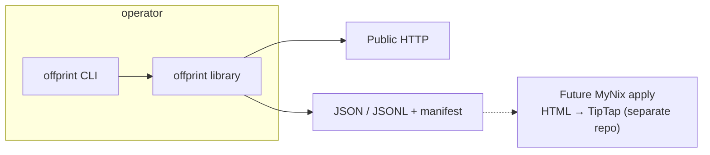
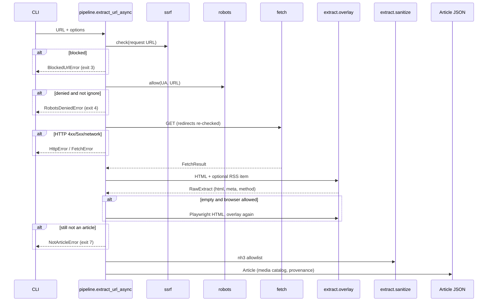
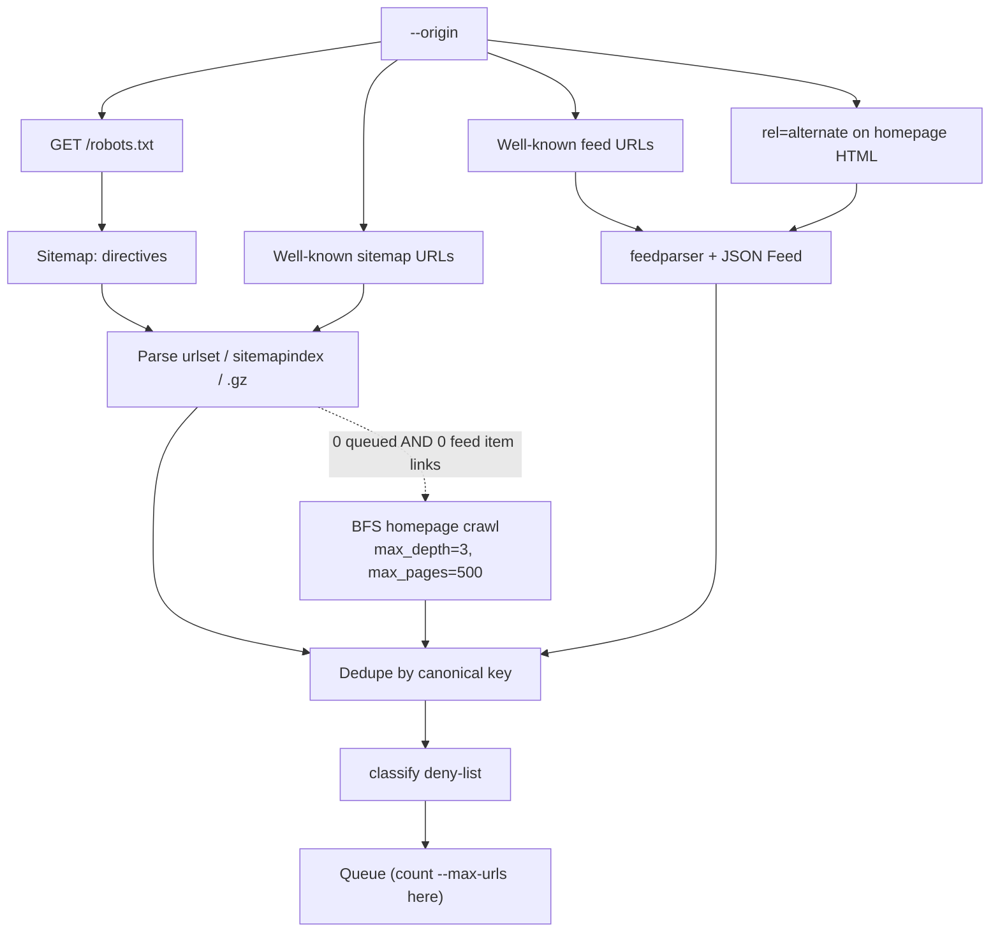
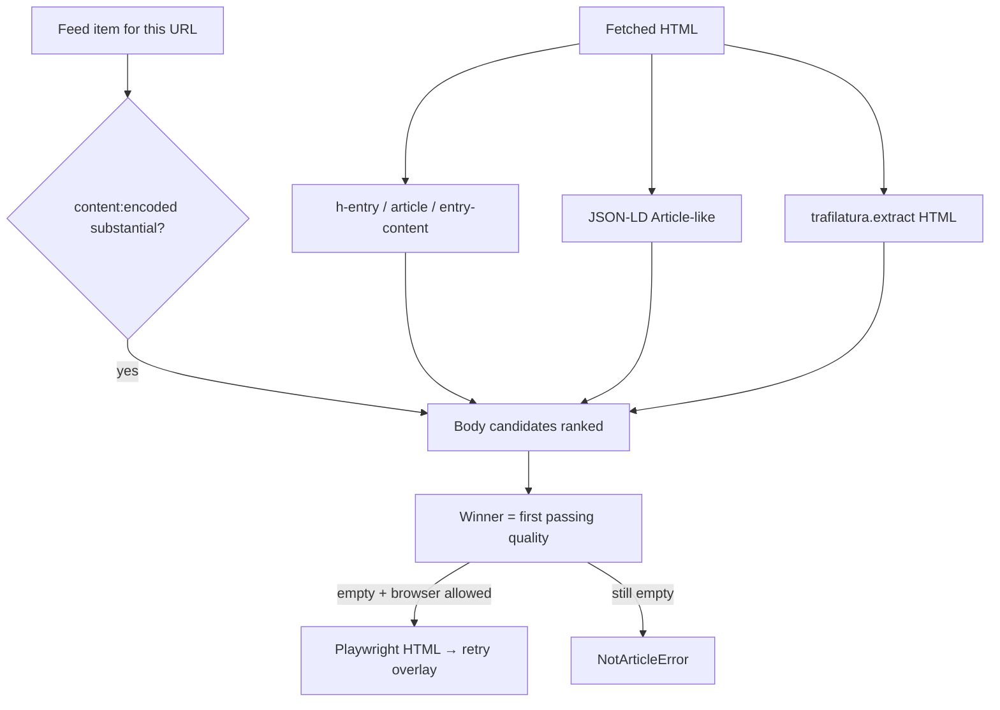
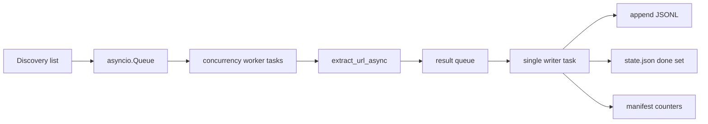

# Offprint — Python CLI article extractor

| Field | Value |
| --- | --- |
| **Document** | Implementation design (v1) |
| **Author** | Eugen Mihailescu (placeholder: implementer PRs follow this spec) |
| **Date** | 2026-08-25 |
| **Status** | Draft |
| **Repo** | https://github.com/eugenmihailescu/offprint (public, currently empty) |
| **Workspace** | `/home/eugen/workspace/Python/offprint` (local clone; no project files yet) |
| **License** | MIT (match MyNix: Copyright (c) 2026 Eugen Mihailescu) |
| **Language** | Python 3.12+ (CI pinned to 3.12) |

---

## Overview

Offprint is a **greenfield** Python CLI + library that extracts the *article* from a public URL or a public site and emits a **CMS-agnostic JSON document** (or a JSONL corpus). It does not import into a database, does not parse WordPress WXR, and does not speak TipTap, Puck, or MyNix tables.

The core insight: CMS-private dialects (WP shortcodes, Elementor postmeta, Ghost cards) are unreadable without the original renderer. The **public document** — HTML, RSS/Atom `content:encoded`, JSON-LD `BlogPosting`/`Article` — is the universal source. Offprint never parses plugin DSLs.

A later MyNix step may *apply* Offprint HTML → TipTap. That converter already walks a set of semantic tags (`htmlToTipTapDoc`); unknown tags may unwrap. An `htmlIsland` node **does not exist** in MyNix today — if MyNix later adds a similar escape hatch, that is apply-side, not Offprint. Offprint’s job is a faithful, sanitized article body plus metadata, with URLs for media rather than a CMS media library.

Target UX:

```text
offprint https://old.blog/2020/foo/
offprint --origin https://old.blog --out corpus.jsonl
```

GitHub About (**set now**): *Extract the article from a URL or a whole site. Emits structured JSON (title, body HTML, metadata) — not CMS rows, not a scraper toolkit.*

Topics: `article-extraction`, `cli`, `readability`, `rss`, `sitemap`, `jsonl`, `html`.

---

## Background & Motivation

### Current state (consumer CMS, not this repo)

MyNix (`/home/eugen/workspace/NextJS/mynixworld`) already has two **different** content pipelines:

| Pipeline | Kind | Code | What it is |
| --- | --- | --- | --- |
| WP WXR import | `wordpress-wxr` only | `lib/import/` (`jobs/types.ts` `IMPORT_PROVIDERS`) | Database load: WXR XML + known shortcodes → TipTap. Writes `post_*`. |
| Portable JSON | `mynix-post` / `mynix-page` | `lib/content-portability/` | MyNix ↔ MyNix move. TipTap/Puck trees, media catalog with checksums. Max 2 MiB. |

Neither is Offprint. Offprint must **not** write into the MyNix repo, must **not** import MyNix modules, and must **not** know `post_*`, TipTap, Puck, or `MEDIA_ROOT`.

Fidelity QA already treats **live public HTML** as ground truth: `scripts/compare-wp-legacy.py` fetches WordPress pages, strips chrome (`WP_STRIP_XPATH`: share bars, related posts, scripts), and scores body text/images/math/headings against the imported site. That script is evidence that the rendered document is the right source — and a source of **extraction heuristics** (e.g. `div.entry-content`, `h1.entry-title`) to encode as generic HTML selectors, not as a WP importer.

MyNix’s own RSS (`lib/seo/data.ts` `buildRssXml`) emits `<description>` only, not `content:encoded`. Classic WordPress feeds often *do* emit full `content:encoded`. Offprint must treat feeds as **discovery + optional full body**, never assume every `<description>` is the article.

Future MyNix apply (not v1 Offprint) will likely reuse `lib/import/transforms/html-to-tiptap.ts` (`htmlToTipTapDoc`). That walker already handles `p`/`h1–h6`/`ul`/`ol`/`blockquote`/`pre`/`figure`/`table`/`img`, YouTube `<iframe>` as `mediaBlock`, and math via `data-latex` / `data-display`. Native `<video>`/`<audio>`/`<picture>` are **not** first-class there (WP import uses `data-import="media"` markers). Offprint still **prefers** tags that walker already understands; it is CMS-agnostic and may emit `<video>` / Vimeo iframes that a MyNix apply step will unwrap or drop. There is no `htmlIsland` in MyNix — do not design Offprint output around a node that does not exist.

### Pain points this tool addresses

- WXR + shortcode expansion is **one CMS, one dialect**, and silently drops unknown builders.
- Public HTML already contains the rendered article, JSON-LD metadata, and media URLs.
- Operators need a **replayable corpus** (JSONL + optional raw HTML) they can re-apply as CMS converters evolve.
- A future MyNix sidecar needs **stable exit codes**, a versioned schema, and a CLI — not an in-process Python extension inside Next.js.

---

## Goals & Non-Goals

### v1 Goals

- Extract **one public URL** to stdout or a file as `offprint-article` JSON.
- Discover a site (**sitemap.xml + RSS/Atom**, homepage crawl last resort) and emit **JSONL** plus a small run manifest.
- Deterministic, replayable: optional `--save-html` stores raw bytes beside records.
- Strong tests on **fixture HTML/XML** (no live network in default CI).
- Clear README, MIT license, Python `.gitignore`, GitHub Actions on 3.12.
- Logging with verbosity flags; **exit codes** a wrapper can branch on.
- Library API in-process (`extract_url` / `extract_url_async`, `extract_site` / `extract_site_async`) used by the CLI and tests.

### v1 Non-goals

- Writing MyNix `post_*` / TipTap / Puck / `MEDIA_ROOT`.
- WordPress WXR parsing (stays in MyNix `lib/import/`).
- Comments, drafts, private/member/paywall content.
- Reconstructing page-builder editability (Elementor/Gutenberg blocks as objects).
- Hosted multi-tenant HTTP API (sidecar is future work only).
- Screenshot/PDF as the body; loading old theme/plugin JS/CSS as the product.
- AI as the primary extractor (optional later assist **on already-extracted HTML only**).
- WARC output (optional later; not required).
- Publishing to PyPI. Install is git-only until a consumer exists: `pip install git+https://github.com/eugenmihailescu/offprint`. Still tag GitHub `v0.1.0` after PR 6; do **not** publish that tag to PyPI.

---

## Proposed Design

### Process model

v1 is a **CLI + importable library** in this repo. Not an always-on HTTP service. Not in-process in Next.js. A later HTTP sidecar would shell out to `offprint` or import the library; mention only as future work.



### Package layout

Use **src layout** so tests import the installed package, not a random cwd:

```text
offprint/                          # repo root
  pyproject.toml                   # hatchling, console script `offprint`
  LICENSE                          # MIT, 2026 Eugen Mihailescu
  README.md
  SECURITY.md
  .gitignore
  .github/workflows/ci.yml
  schemas/
    offprint-article.v1.json       # generated from pydantic; committed
    offprint-run.v1.json
  src/offprint/
    __init__.py                    # public re-exports; __version__ from importlib.metadata
    __main__.py                    # python -m offprint
    py.typed
    cli.py                         # argparse, argv sugar, exit codes
    log.py                         # stdlib logging setup
    errors.py                      # OffprintError + exit_code/code
    constants.py                   # limits, tracking params (not version)
    dates.py                       # ISO-8601 + RFC 2822 → UTC Z (no dateutil)
    model.py                       # pydantic v2 Article, Media, Provenance, RunManifest
    schema.py                      # dump JSON Schema (library; CLI wires in PR 5)
    urls.py                        # canonicalize, origin, www/apex match, tracking strip
    ssrf.py                        # IP/host/scheme policy + DNS preflight
    robots.py                      # protego wrapper (crawl-delay, request_rate)
    fetch.py                       # FetchClient, FetchResult, redirects, decompressed byte cap
    session.py                     # RunSession: one AsyncClient + robots cache + optional browser
    pipeline.py                    # extract_url / extract_url_async
    extract/
      __init__.py                  # ExtractResult, run_extractors
      htmlutil.py                  # lxml parse, chrome strip
      jsonld.py                    # BlogPosting / Article
      metadata.py                  # OG, twitter, html lang, dates
      hentry.py                    # h-entry / <article> / entry-content
      feeds_match.py               # RSS item overlay for a URL
      trafilatura_ext.py           # wrap trafilatura.extract only
      overlay.py                   # priority + merge rules
      sanitize.py                  # nh3 allowlist
      media.py                     # catalog /<video>/og:image
      browser.py                   # optional playwright (import-guarded)
    discover/
      __init__.py                  # discover_urls(origin) → Discovery
      sitemap.py                   # urlset + index + .gz
      feeds.py                     # RSS/Atom via feedparser; JSON Feed via stdlib json
      classify.py                  # article vs listing URL heuristics
      crawl.py                     # homepage BFS last resort
    site/
      __init__.py                  # extract_site
      job.py                       # queue, concurrency, politeness
      manifest.py                  # offprint-run JSON
      resume.py                    # done-set + crash-safe JSONL append
  tests/
    conftest.py
    unit/                          # ssrf, urls, model, robots, sanitize
    extract/                       # overlay vs fixtures
    discover/
    cli/
    live/                          # pytest.mark.live, not in default CI
  fixtures/
    html/
    feeds/
    sitemaps/
    robots/
    expected/                      # golden article JSON (fetchedAt stripped)
```

**Not** a flat package at repo root. Hatchling discovers `src/offprint`.

### Module responsibilities

| Module | Responsibility |
| --- | --- |
| `cli.py` | Parse argv, map to library functions, print JSON, set exit code. Never fetch directly. |
| `errors.py` | Typed failures with stable `code` strings and `exit_code`. |
| `dates.py` | `parse_datetime(value) -> str \| None`: `datetime.fromisoformat` (accept `Z`) and `email.utils.parsedate_to_datetime` for RFC 2822. No `python-dateutil`. Invalid → `None`. |
| `urls.py` | Parse, IDNA, canonicalize, tracking-query strip, origin parse, www/apex **match** (not rewrite). |
| `ssrf.py` | Scheme/host/IP allow-deny; used on the operator URL, every redirect, and every Playwright request. |
| `robots.py` | Fetch/parse `robots.txt` once per origin host; `can_fetch`; crawl-delay + request_rate, clamped. |
| `fetch.py` | `FetchClient` (wraps one `httpx.AsyncClient` with `NullCookies`). Timeouts, redirect loop, **decompressed** byte cap, charset. |
| `session.py` | `RunSession`: `client`, `robots`, optional `browser`, `aclose()`. Site job holds one session. |
| `pipeline.py` | `extract_url` / `extract_url_async`. Does **not** discover feeds. |
| `extract/overlay.py` | Body + metadata merge rules (this is the product). |
| `extract/trafilatura_ext.py` | **Only** `trafilatura.extract` + `extract_metadata` on *already-fetched* HTML. Never `trafilatura.fetch_url`. |
| `extract/browser.py` | Optional; `playwright.async_api` only; every request through `ssrf.py`. |
| `discover/*` | Produce a `Discovery` (queued URLs + `feed_index`). Do not extract. |
| `site/job.py` | `extract_site_async`: politeness scheduler, JSONL write, manifest. Resume is PR 9. |

### CLI: flags *and* subcommands

**Pick: argparse** (stdlib). The UX is two invocations and a handful of flags, not a nested command tree. Zero extra dependency; easy for a future sidecar to spawn. Click would be nicer for plugins we do not have; tyro is aimed at typed-function CLIs and fights optional subcommands.

**Dispatch sugar** (so both product lines work without typing a verb):

There is **no** `batch` verb. `--urls-file` is a **site** flag that disables sitemap/feed/crawl discovery and extracts that list instead.

| Invocation | Mode |
| --- | --- |
| `offprint https://old.blog/2020/foo/` | `extract` |
| `offprint extract URL` | `extract` (explicit) |
| `offprint --origin https://old.blog --out corpus.jsonl` | `site` |
| `offprint site --origin https://old.blog --out corpus.jsonl` | `site` |
| `offprint --urls-file urls.txt --out corpus.jsonl` | `site` with discovery off |
| `offprint schema` | write article JSON Schema to stdout (CLI lands in PR 5) |
| `offprint schema --run` | write run-manifest schema |
| `offprint --version` / `offprint version` | `importlib.metadata.version("offprint")` |

`cli.preprocess_argv(argv)` rewrites the first token:

1. If `argv[0]` is `extract|site|schema|version`, leave it.
2. Else if a non-option positional exists (URL), insert `extract`.
3. Else if `--origin` or `--urls-file` is present, insert `site`.
4. Else argparse help / usage error (exit 2).

Shared flags (extract + site):

| Flag | Default | Meaning |
| --- | --- | --- |
| `--out PATH` | extract: stdout; site: **required** (recommend `corpus.jsonl`) | Destination. `.jsonl` → JSONL; otherwise a single JSON object (extract only). |
| `--pretty` | on if stdout is a TTY and mode is extract | Indent JSON. JSONL is always compact. |
| `--ignore-robots` | off | Operator-owned sites only. Logged at WARNING. |
| `--timeout SEC` | `20` | Read timeout. |
| `--connect-timeout SEC` | `10` | Connect timeout. |
| `--max-bytes N` | `10485760` (10 MiB) | **Decompressed** response cap (HTML/XML). |
| `--max-redirects N` | `5` | Hard cap 10. |
| `--user-agent STR` | see below | Override UA (non-empty). `OFFPRINT_USER_AGENT` env is a last-resort override only when the flag is omitted; flags win. |
| `--save-html DIR` | off | Raw HTML per URL (`{sha256}.html` + pointer in provenance). |
| `--browser` | omitted → `None` (auto) | `ExtractOptions.browser=True`: always try Playwright. Exit 2 if extra missing. |
| `--no-browser` | omitted → `None` (auto) | `browser=False`: never Playwright. If **both** flags omitted: `None` = fallback **only** when extra is installed **and** body is empty; extra missing → silent skip (not an error). |
| `--min-text-chars N` | `200` | Below this → `not_an_article`. |
| `--probe-media` | off | Optional HEAD/GET for mime/size (same SSRF policy). |
| `--download-media DIR` | off | Optional bytes dump; default **off**. |
| `-v` / `-vv` | warning / info / debug | Verbosity. |
| `--log-format text\|json` | `text` | JSON logs on stderr for a sidecar. |
| `-q` / `--quiet` | — | Warnings+ only; no progress. |

Site-only:

| Flag | Default | Meaning |
| --- | --- | --- |
| `--origin URL` | required for site unless `--urls-file` supplies URLs | Normalized to `scheme://host[:port]` (path/query/fragment stripped). Missing host → exit 2. Item **extract** stays on this origin **or its www/apex twin**. Sitemap/feed **fetches** may be cross-origin after SSRF. |
| `--out-dir DIR` | directory of `--out`, else `./offprint-run-<host>/` | Manifest, state, optional HTML. |
| `--concurrency N` | `4` (`2` if `--browser`) | In-flight cap **per origin**. Hard cap 16 (`4` if `--browser`). Concurrency > 1 on a single origin is intentional (start-spacing still applies). |
| `--delay SEC` | `0.5` | Minimum **start** spacing per origin. Combined with robots crawl-delay / request_rate via `max(--delay, min(robots_interval, 10))`. The **10 s clamp applies only to protego** (hostile `Crawl-delay: 86400`), never to the operator’s `--delay`. `--delay 30` stays 30. `--delay 0` still honors robots unless `--ignore-robots`. |
| `--limit N` | unlimited | Stop after N **successful** extracts. Does not cap discovery. |
| `--max-urls N` | `50000` | Cap on **queued article URLs** (after classify), not raw sitemap locs. |
| `--include-path GLOB` | — | Repeatable. `fnmatch` on URL path (trailing-slash normalized). If any include is set, a URL must match at least one or it is not queued; include **bypasses the built-in deny-list**. |
| `--exclude-path GLOB` | none (deny-list is separate) | Repeatable extra denials; applied even when include matched. |
| `--resume` | **off** | Skip `canonical_key`s already in `state.json`; append JSONL. Never auto-on just because `--out-dir` exists. |
| `--overwrite` | off | Truncate JSONL + fresh manifest (and state if present). If `--out` exists and neither `--resume` nor `--overwrite` → exit 2. **Ships in PR 6** so the first site CLI is usable; `--resume` stays PR 9. Until resume exists, a second run must pass `--overwrite` or a new `--out`. |
| `--no-crawl` | crawl if `queued==0` **and** site-family feed item links==0 (unless this flag) | Never homepage BFS. Trigger is **empty extract queue**, not “sitemap document missing.” A taxonomy-only sitemap still falls through to crawl. |
| `--urls-file PATH` | — | Skip discovery. UTF-8, one URL per line, `#` comments, skip blanks, BOM ignored, cap `--max-urls`. If `--origin` omitted, origin is `parse_origin` of the first valid URL; other families are `off_origin` skips. Zero valid URLs and no `--origin` → exit **2**. **Does not apply the built-in deny-list** (operator listed these URLs). Still SSRF, robots at extract, `same_site_family`, and user `--exclude-path`. |

Stderr is for logs/progress; stdout is for JSON when `--out` is omitted. Site mode refuses to dump a corpus to a TTY without `--out` (exit 2) so operators cannot accidentally spew 10k lines into a terminal.

### Library API

```python
# src/offprint/__init__.py
from importlib.metadata import PackageNotFoundError, version as pkg_version

from offprint.errors import OffprintError
from offprint.fetch import FetchResult
from offprint.model import Article, RunManifest
from offprint.pipeline import ExtractOptions, extract_url, extract_url_async
from offprint.site import SiteOptions, extract_site, extract_site_async

try:
    __version__ = pkg_version("offprint")
except PackageNotFoundError:
    __version__ = "0.0.0"

__all__ = [
    "Article",
    "ExtractOptions",
    "FetchResult",
    "OffprintError",
    "RunManifest",
    "SiteOptions",
    "extract_site",
    "extract_site_async",
    "extract_url",
    "extract_url_async",
    "__version__",
]
```

**Async contract (do not nest `asyncio.run`):**

- `extract_url_async` / `extract_site_async` are the real implementations.
- Sync wrappers call `asyncio.run(...)` **only** when `asyncio.get_running_loop()` raises `RuntimeError`. If a loop is already running, calling the sync wrapper is a `UsageError` (`code=usage`, message: use the `_async` variant).
- `extract_site_async` calls `extract_url_async` (never `extract_url`) and holds **one** `RunSession` / `httpx.AsyncClient` for the run.
- **v1 limitation:** `extract_url` does **not** discover or fetch feeds. RSS body overlay happens only when `ExtractOptions.feed_index` is injected (site mode does this).

**Filesystem side effects:**

| Function | Writes |
| --- | --- |
| `extract_url` / `_async` | None by default. If `save_html_dir` is set, writes `{sha256}.html`. If `download_media_dir` is set, may write media bytes. Returns `Article`. |
| `extract_site` / `_async` | Always writes `out_path` (JSONL, created/appended), `{out_dir}/manifest.json`. With `--resume`/`resume=True`, reads/writes `{out_dir}/state.json`. Optional save-html / media dirs. Returns `RunManifest` **after** those writes. |

```python
from dataclasses import dataclass
from pathlib import Path
from collections.abc import Mapping
from datetime import datetime

@dataclass(frozen=True)
class ExtractOptions:
    origin: str | None = None          # same-origin *family* constraint when set
    ignore_robots: bool = False
    timeout: float = 20.0
    connect_timeout: float = 10.0
    max_bytes: int = 10 * 1024 * 1024  # decompressed
    max_redirects: int = 5
    user_agent: str | None = None
    save_html_dir: Path | None = None
    browser: bool | None = None        # None=auto fallback; True=force; False=never
    min_text_chars: int = 200
    probe_media: bool = False
    download_media_dir: Path | None = None
    feed_index: Mapping[str, FeedItem] | None = None  # injected by site mode
    session: RunSession | None = None  # site injects shared client; None → ephemeral

@dataclass(frozen=True)
class SiteOptions:
    origin: str                        # required unless urls_file-only; normalized
    out_path: Path                     # JSONL destination (required)
    out_dir: Path | None = None
    concurrency: int = 4
    delay: float = 0.5
    limit: int | None = None           # successful extracts
    max_urls: int = 50_000             # queued after classify
    include_paths: tuple[str, ...] = ()
    exclude_paths: tuple[str, ...] = ()
    resume: bool = False
    overwrite: bool = False
    no_crawl: bool = False
    urls_file: Path | None = None
    ignore_robots: bool = False
    timeout: float = 20.0
    connect_timeout: float = 10.0
    max_bytes: int = 10 * 1024 * 1024
    max_redirects: int = 5
    user_agent: str | None = None
    save_html_dir: Path | None = None
    browser: bool | None = None
    min_text_chars: int = 200
    probe_media: bool = False
    download_media_dir: Path | None = None

    def to_extract_options(self, feed_index: Mapping[str, FeedItem] | None, session: RunSession) -> ExtractOptions:
        ...

class FetchClient:
    """Wraps httpx.AsyncClient(cookies=NullCookies(), follow_redirects=False)."""
    async def get(self, url: str) -> FetchResult: ...
    async def aclose(self) -> None: ...

class RobotsCache:
    """One protego document per origin host, fetched via FetchClient."""
    async def allow(self, url: str, ua: str) -> bool: ...
    def crawl_interval(self, url: str, ua: str) -> float: ...  # 0 if none / ignore

@dataclass
class RunSession:
    """One per extract_site run; extract_url may allocate an ephemeral session."""
    client: FetchClient
    robots: RobotsCache
    browser: object | None = None  # playwright.async_api.Browser, lazy

    async def aclose(self) -> None:
        if self.browser is not None:
            await self.browser.close()
            self.browser = None
        await self.client.aclose()

@dataclass(frozen=True)
class FeedItem:
    link: str
    guid: str | None = None
    title: str | None = None
    published: str | None = None       # UTC Z or None (from feedparser or JSON Feed)
    updated: str | None = None
    author: str | None = None
    tags: tuple[str, ...] = ()
    content_html: str | None = None
    summary: str | None = None

@dataclass(frozen=True)
class FetchResult:
    requested_url: str
    final_url: str
    status: int
    content_type: str | None
    body: bytes                        # decompressed, already size-capped
    redirects: tuple[str, ...]
    fetched_at: datetime               # timezone-aware UTC

@dataclass(frozen=True)
class SkippedUrl:
    url: str
    code: str                          # classify | robots_denied | off_origin | not_an_article | already_done

@dataclass(frozen=True)
class Discovery:
    origin: str                        # normalized operator origin
    urls: tuple[str, ...]              # queued article URLs, deduped, ≤ max_urls
    aliases: Mapping[str, tuple[str, ...]]  # canonical_key → aliases
    feed_index: Mapping[str, FeedItem]      # canonical_key → item
    skipped: tuple[SkippedUrl, ...]    # classify skips sampled for tests; not all 50k
    sitemaps_fetched: tuple[str, ...]
    feeds_fetched: tuple[str, ...]
    used_crawl: bool
    discovered_count: int              # origin-family unique locs before classify
```

CLI maps flags onto these dataclasses; it does not reimplement fetch/extract.

### Pipeline (single URL)



### Discovery (site mode)

Order is **decided**: sitemap → RSS/Atom → explicit URL list → homepage crawl last.



`--origin` normalization (`urls.parse_origin`): parse as URL; reject missing host (exit 2); strip path, query, fragment; IDNA-lowercase host; drop default ports; result `scheme://host[:port]`.

**Site-family match** (`urls.same_site_family(a, b)`) — used only for **enqueue and extract eligibility**, not for rewriting stored URLs:

- Scheme-insensitive (`http`/`https` both ok) + host with a single leading `www.` stripped + port (after default-port drop).
- `https://old.blog` matches `http://www.old.blog`.
- Does **not** match `cdn.old.blog` or `static.example.net`.

Stored `origin` on the article is the **operator** normalized origin, never the www twin.

**Two fetch policies:**

| What | Allowed targets |
| --- | --- |
| Sitemap/feed **resource** fetch (`Sitemap:` in robots, sitemapindex child `<loc>`, `rel=alternate` href, well-known paths) | Any public http(s) URL that passes SSRF. Child sitemaps on `www.`, S3, or a CDN are fetched. |
| **Item URLs queued for extract** (urlset `<loc>`, feed `link`/`guid` if URL, crawl `<a href>`) | Must `same_site_family` the operator origin. Other hosts (CDN HTML pages, FeedBurner *item* links that leave the family) are not queued. |

Well-known sitemaps: try on the operator origin **and** its www/apex twin (one extra host). Paths: `/sitemap.xml`, `/sitemap_index.xml`, `/wp-sitemap.xml`, `/sitemap.xml.gz`, `/sitemap_index.xml.gz`.

Well-known feeds: same twin try. Paths: `/feed`, `/feed/`, `/rss`, `/rss.xml`, `/atom.xml`, `/index.xml`, `/feed.xml`, `/feeds/posts/default?alt=rss`.

Homepage HTML (operator origin): collect `<link rel="alternate" type="application/rss+xml|application/atom+xml|application/feed+json">`. Those hrefs may be FeedBurner (cross-origin fetch allowed). Item links inside the parsed feed still must be site-family to enqueue.

Sitemap parser (`discover/sitemap.py`):

- `sitemapindex` → fetch child sitemap locs (cap **50** sitemaps), SSRF each; **no** site-family requirement on the sitemap document URL.
- `urlset` → collect `<loc>` (and `<lastmod>` for logging only). Enqueue only if site-family + SSRF.
- Recode `.gz` if `Content-Type` is gzip or URL ends with `.gz` (decompress into the same byte cap).
- Parse with `lxml.etree.XMLParser(resolve_entities=False, no_network=True, huge_tree=False)` (see Security).

Feed parser (`discover/feeds.py`):

- RSS/Atom: `feedparser.parse(body, response_headers={"content-type": content_type or "application/xml"})` — **never** pass a URL (feedparser must not fetch). Prefer `content[]` / `content:encoded` over `summary` for `FeedItem.content_html`. Dates: feedparser’s `published_parsed` / `updated_parsed` (`time.struct_time` → UTC Z); else `dates.parse_datetime` on the raw string.
- JSON Feed: feedparser does **not** parse this. If `Content-Type` is `application/feed+json` **or** `json.loads` has `"version"` starting with `https://jsonfeed.org/version/` (or `"items"` + `"feed_url"`), map with stdlib `json`: `items[].url`/`id` → link/guid, `content_html` / `content_text`, `date_published` / `date_modified`, `authors[].name`, `tags`. `content_text` is summary unless `content_html` is present.
- Build `feed_index: dict[canonical_key, FeedItem]`.

**Homepage crawl last resort** (`discover/crawl.py`) — included in v1 / PR 6, not a stub:

- Only if classify+feeds yielded 0 **queued** URLs **and** feeds yielded 0 site-family item links, and `--no-crawl` is not set. (A Yoast sitemap that lists only `/category/…` still triggers crawl.)
- BFS from origin `/`, site-family hrefs only, depth ≤ 3, ≤ 500 pages fetched.
- Same politeness scheduler as extract.
- Classify crawl hrefs before enqueue; `--max-urls` still applies.
- **After crawl:** recompute the origin-family loc set. If it is still `{origin/}` **or** the queue is empty and the only fetched page was `/`, classify `/` with `only_home=True` so a homepage-only site with no sitemap/feeds still extracts one article. Crawl of `/` for links does not enqueue `/` unless this post-crawl `only_home` holds.
- Fixture: `fixtures/html/home_no_links.html` + no sitemap/feeds → one queued URL (`/`).

**URL classification** (`discover/classify.py`) — **deny-list**, not allow-list. Anything not denied is queued (including `/2020/06/slug`, `/essays/slug`, `/blog/2020/foo`).

```text
def normalized_path(url) -> str:
    # path only; trailing slash stripped except "/"

def matches_glob(path, pattern) -> bool:
    # fnmatch.fnmatch(path, pattern) or fnmatch.fnmatch(path + "/", pattern)
    # also try path.lstrip("/") vs pattern.lstrip("/") so "blog/*" matches "/blog/foo"

def denied_prefix(path, prefix) -> bool:
    # segment-bounded: "/feed" must not match "/feedback/my-post"
    p = prefix.rstrip("/")
    return path == p or path.startswith(p + "/")

def should_queue(url, *, include_paths, exclude_paths, only_home: bool,
                 apply_deny_list: bool = True) -> bool:
    path = normalized_path(url)
    query = parse_qs(...)

    # 1. user include: if any --include-path, URL must match one; match bypasses deny-list
    included = False
    if include_paths:
        if not any(matches_glob(path, g) for g in include_paths):
            return False
        included = True

    # 2. user exclude (always, including --urls-file)
    if any(matches_glob(path, g) for g in exclude_paths):
        return False

    if included or not apply_deny_list:
        return True   # --urls-file: operator listed it; skip built-in deny-list

    # 3. built-in deny-list
    if path in ("", "/") and not only_home:
        return False   # homepage skip unless it is the only discovered URL
    DENY_PREFIXES = (
        "/tag/", "/tags/", "/category/", "/categories/",
        "/author/", "/authors/", "/search", "/search/",
        "/wp-admin", "/wp-json", "/wp-login",
        "/cart/", "/checkout/", "/account/",
        "/comments/feed", "/feed", "/feed/", "/cdn-cgi/",
    )
    if any(denied_prefix(path, p) for p in DENY_PREFIXES):
        return False
    if re.fullmatch(r"/page(s)?/\d+", path):  # root pagination only; /blog/page/2 still queues
        return False
    if query.keys() & {"replytocom", "s"} or query.get("preview") == ["true"] or "paged" in query:
        return False
    if "/attachment/" in path or "attachment_id" in query:
        return False
    if re.search(r"\.(?:jpe?g|png|gif|webp|svg|mp4|mp3|pdf|zip)(?:$|\?)", path, re.I):
        return False
    return True
```

**When `only_home` is true:** after collecting the origin-family loc set `L` (sitemap + feeds + well-known, **and again after last-resort crawl**):

```text
home_key = canonical_key(origin + "/")
only_home = {canonical_key(u) for u in L} == {home_key}
# also True when queued == 0 and the only page fetch in crawl was origin/
```

If a classify pass yields `queued == 0` and `L` is exactly `{origin/}`, re-run with `only_home=True`. Homepage-only sites, no-sitemap homepages after crawl, and `--urls-file` containing only `https://old.blog/` therefore enqueue `/`.

**`--urls-file`:** `apply_deny_list=False`. An explicit `/tag/foo` is queued (still robots/SSRF/`same_site_family`). User `--exclude-path` still applies.

`--max-urls` is applied **after** classify: keep accepting sitemap/feed locs for `discovered_count`, but stop appending to `Discovery.urls` once `len(urls) == max_urls`. A Yoast sitemap that lists taxonomies first cannot fill the queue with archives.

Fixtures: `fixtures/sitemaps/posts_yyyy_mm.xml` (`/2020/06/slug` queued); `fixtures/sitemaps/taxonomy.xml` (`/category/foo` skipped); `fixtures/sitemaps/index_www.xml` (child loc `https://www.example.com/sitemap-posts.xml` is fetched when origin is `https://example.com`); `fixtures/sitemaps/home_only.xml` (`https://example.com/` only → one queued URL); `fixtures/sitemaps/feedback.xml` (`/feedback/my-post` queued, `/feed/atom` skipped).

### URL identity and dedupe

Idempotency key for **consumers**: `origin + canonicalUrl`.

Offprint’s **internal** dedupe key (`urls.canonical_key`):

1. Parse with `urllib.parse`; require `http`/`https`.
2. IDNA-encode host; lowercase scheme and host.
3. Drop default ports (`:80`, `:443`).
4. Drop fragment.
5. Strip tracking query keys (case-insensitive). Built-in set in `constants.TRACKING_PARAMS`:

   `utm_source`, `utm_medium`, `utm_campaign`, `utm_term`, `utm_content`, `utm_id`, `utm_reader`, `gclid`, `gbraid`, `wbraid`, `fbclid`, `mc_cid`, `mc_eid`, `igshid`, `_ga`, `_gl`, `msclkid`, `twclid`, `yclid`, `dclid`, `li_fat_id`, `wickedid`, `ncid`, `srsltid`, `ref_src`, `ref_url`, `share`, `amp`.

6. Percent-decode unreserved characters in path; keep `/` structure.
7. Trailing slash: **strip** except for path `""` or `"/"`.
8. Do **not** rewrite `www` vs apex in stored URLs unless an HTTP redirect already did. `same_site_family` is matching-only.

Discovery map: `key → {best_url, aliases[]}`. After extract, `canonicalUrl` is:

1. Absolute `<link rel="canonical">` if `same_site_family` the operator origin (or https upgrade).
2. Else JSON-LD `url` / `mainEntityOfPage.@id` if site-family.
3. Else `finalUrl` after redirects (canonicalized).

**Do not fetch** a canonical that points elsewhere just because it is listed (open-redirect / SSRF). Record it on the document if it is a valid http(s) URL; if it is cross-origin, still emit it as `canonicalUrl` (publisher intent) and put the fetched URL in `discoveredUrls`. Consumers key on origin (operator) + that canonical.

`discoveredUrls`: unique list of request URL, redirect hops, feed guid/link, trailing-slash twin, `www` twin if seen. All absolute.

`origin`: operator `--origin` if set, else `scheme://host[:port]` of the **request** URL (not the canonical, which may be a CDN or syndicate).

### Extractor overlay (body vs metadata)

Two independent merges. **Body** picks a winner (with fallbacks). **Metadata** fills empty fields from richer sources without overwriting a better one.



**Body priority** (first that passes `is_substantial` wins). JSON-LD is **not** above the CMS body: many publishers put a dek in `articleBody` while the post lives in `div.entry-content`. MyNix `blogPostingJsonLd` has no `articleBody`; `compare-wp-legacy.py` uses `entry-content`.

1. **`rss`** — feed `content:encoded` or Atom `content` with `type=html`/`xhtml`, **only if** it is substantial **and** longer than the feed `summary` by ≥ 1.5× or ≥ `min_text_chars`. Excerpt-only feeds must not become the body.
2. **`html-article`** — first of: `h-entry .e-content`, `div.entry-content`, `div.post-content`, `div.article-content`, `[itemprop=articleBody]`, `article`. Chrome-strip **inside the chosen node** before measuring (do not drop `header` descendants of that node).
3. **`jsonld`** — never beats a substantial html-article candidate with a dek.
   - If an html-article candidate exists: require HTML tags (`<p` / `<div` / `<br` / `<h`) **and** jsonld text length ≥ 1.5× that candidate **and** `is_substantial`.
   - If there is **no** html-article candidate: allow plaintext `articleBody` when `len(text) ≥ min_text_chars`; wrap as escaped `<p>` paragraphs (JSON-LD-only sites).
   - Plaintext JSON-LD with a rich `entry-content` sibling must **not** win (dek fixture).
4. **`trafilatura`** — `trafilatura.extract(html, url=final_url, output_format="html", include_comments=False, include_tables=True, include_images=True, include_links=True, include_formatting=True, favor_recall=True)`. If HTML output is empty, try `output_format="txt"` only to decide not-an-article vs retry; do not emit plaintext wrapped in a single `<p>` unless no HTML exists and text ≥ `min_text_chars`.
5. **`browser`** — Playwright on the already-validated URL; then repeat steps 2–4 on the rendered HTML. Not the default path.

```text
def is_listing(html, text) -> bool:
    # high link density, independent of min_text_chars
    if count_anchors(html) < 5:
        return False
    anchor_chars = text_length_inside(html, "a")
    return (anchor_chars / max(len(text), 1)) > 0.5

def is_substantial(html, *, min_text_chars) -> bool:
    text = strip_text(html)
    if is_listing(html, text):
        return False
    imgs = count_imgs_and_figures(html)
    if len(text) >= min_text_chars:
        return True
    if imgs >= 2 and len(text) >= 80:
        return True
    return False
```

Fixture: `fixtures/html/category_listing.html` — >200 characters of link text, ≥5 `<a>`, little unique prose → `not_an_article` even though `len(text) ≥ min_text_chars`.

**Chrome strip** (generic, inspired by `compare-wp-legacy.py` `WP_STRIP_XPATH`, not a WP importer):

- Always drop `script`, `style`, `noscript`.
- On the **full page** (before picking an html-article node): drop `nav`, `footer`, `form`, and elements whose class/id contains `share`, `related`, `addthis`, `sharedaddy`, `yarpp`, `jp-relatedposts`, `ts-fab`, `wpcnt`, `cookie`, `newsletter`, `sidebar`. Also drop `div.tags` / `p.tags` (same as the fidelity script). Do **not** drop every `header` (titles often live there).
- **Inside the chosen article node:** do not drop `header`. Still drop share/related class matches.

Fixture: `fixtures/html/jsonld_dek_plus_entry.html` — short JSON-LD `articleBody` + rich `div.entry-content` → `provenance.method = html-article`.

**Metadata overlay** (first non-empty wins per field):

| Field | Order |
| --- | --- |
| `title` | JSON-LD `headline`/`name` → `og:title` → `twitter:title` → `h1.entry-title` / `h-entry .p-name` → `<title>` (split on ` · ` / ` - ` last site-name chunk) → RSS title |
| `publishedAt` | JSON-LD `datePublished` → `article:published_time` → `time.published[datetime]` / `.dt-published` → RSS `published` |
| `updatedAt` | JSON-LD `dateModified` → `article:modified_time` → RSS `updated` |
| `authorNames` | JSON-LD `author` (Person name or string, list) → `rel=author` / `.p-author` → `meta author` → RSS author/dc:creator |
| `tags` | JSON-LD `keywords` (split comma) → `article:tag` → `rel=tag` / `.p-category` → RSS tags (not `category` domain) |
| `categories` | JSON-LD `articleSection` → RSS `tags` with scheme/category where distinguishable |
| `lang` | `<html lang>` → JSON-LD `inLanguage` → `Content-Language`. `string \| null`; **do not default to `en`**. |
| `excerpt` | JSON-LD `description` → `og:description` → `meta name=description` → RSS summary if not used as body |
| featured image | `og:image` / JSON-LD `image` → first content `` |
| last-resort metadata | `trafilatura.extract_metadata(html)` fills only fields still empty after the rows above (`title`, dates, authors, `lang`, `excerpt`). Never used as a body winner. |

JSON-LD `@type` treated as article-like: `BlogPosting`, `Article`, `NewsArticle`, `TechArticle`, `ScholarlyArticle`, `SocialMediaPosting`. `@graph` and string/array `@type` must be handled. `WebPage` / `CollectionPage` / `ItemList` never win body (metadata only).

`provenance.method` is the **body winner**. `provenance.methodChain` lists every source that contributed body or metadata (additive; helps debug overlay).

**Never** parse `[shortcode]` DSLs. If public HTML still contains `[gallery]`, it stays as text (the renderer failed). Fixture tests should include leftover shortcodes to prove we do not try to expand them.

### Sanitize and media catalog

`extract/sanitize.py` uses **nh3** (Ammonia). Bleach is deprecated; lxml-cleaner is easy to get wrong.

Prefer tags MyNix `htmlToTipTapDoc` already walks; unknown tags may unwrap later. This is **not** a claim that apply will be lossless (`<video>`/`<audio>`/`<picture>` are not first-class in that converter; MathML is unwrapped there).

Allow tags (v1; no MathML):  
`p h1 h2 h3 h4 h5 h6 ul ol li blockquote pre code kbd br hr a img figure figcaption table thead tbody tfoot tr th td caption strong b em i s strike sub sup mark q cite abbr time span div section article aside iframe video audio source picture`.

Allow attributes: `href src srcset sizes alt title width height colspan rowspan datetime lang rel target start type role aria-label aria-hidden data-latex data-display poster controls controlslist preload`. `class` on `code`, `pre`, `span`, `div`, `img` (needed for `tex` math images and language-*). Drop `style`, event handlers, `srcdoc`.

URL policies in sanitized HTML (CMS-agnostic; inspired by `lib/content/safe-url.ts` but not a copy):

- `href`/`src`: `http`, `https`, `mailto`, in-page `#`. Protocol-relative `//` → `https:`. Relative paths resolved against `finalUrl`.
- Drop `javascript:`, `data:`, `file:`, `vbscript:`.
- `iframe`/`embed` src: keep YouTube / youtube-nocookie / youtu.be **and** vimeo / player.vimeo (Offprint is not MyNix-only). Other iframes become a link with the src if http(s), else drop. A future MyNix apply may drop Vimeo because `isSafeEmbedSrc` is YouTube-only — that is apply’s problem.

Output is an **HTML fragment** (no `<html>`/`<head>`). If trafilatura returns a full document, take `body` children.

`text`: nh3-stripped or lxml `text_content()`, whitespace-normalized, used for `min_text_chars` and consumer search. Do not include JSON-LD blobs.

`media[]` collected from the **sanitized** body plus OG/JSON-LD images:

```json
{
  "src": "https://old.blog/wp-content/uploads/2020/foo.jpg",
  "alt": "diagram",
  "title": null,
  "mimeType": null,
  "byteSize": null,
  "width": 800,
  "height": 600,
  "role": "inline"
}
```

`role`: `inline` | `feature` | `og` | `embed`. Dedup by canonicalized `src` (strip WP size suffix `-\d+x\d+` **only as a dedup hint**, do not rewrite `src`).

`--probe-media`: HEAD (fallback GET range) with SSRF, 5 s timeout, 0 body bytes preferred; fill `mimeType`/`byteSize`. Skip on error.

`--download-media DIR`: after a successful extract, GET each unique media URL (SSRF, 20 MiB cap matching MyNix `MAX_UPLOAD_BYTES`), write `{sha256}.{ext}`. Do not zip unless later asked. Default **off**. Failures are warnings, not article failures.

### Playwright extra (`offprint[browser]`)

Playwright is a **second fetcher**. It must use the same SSRF policy as `ssrf.py` on **every** request (document + subresources). Residual risk is **high** if a route is missed; treat a failed policy check as abort, not “best effort.”

- Extra: `playwright>=1.48`. Use `playwright.async_api` only (sync API inside `asyncio` deadlocks).
- Document `playwright install chromium` (not bundled).
- Trigger: see CLI (`None` / `True` / `False`). `--browser` with extra missing → exit 2. Auto-fallback (`None`) with extra missing → skip silently.
- **`extract_site`:** one browser per run, closed in `finally`. **`extract_url`:** launch lazily on first need, close in `finally` (no process-wide singleton).
- Fresh `BrowserContext` per page: no storage state, no cookies, `accept_downloads=False`.
- `page.route("**/*", handler)`: resolve URL through `ssrf.assert_public_http_url` (scheme, host suffixes, no-dot, userinfo, IP blocklist including NAT64). If **any** resolved address is blocked, `route.abort()`. Abort `file:` / non-http(s). CDN asset hosts that pass SSRF are allowed for **rendering only**; they are not extract targets.
- `page.goto(final_url, wait_until="load", timeout=20_000)` then a short settle (`page.wait_for_timeout(250)` max). Do **not** use `networkidle` (flaky / discouraged). Timeout → `FetchError` (`network`), not a hang.
- Default `--concurrency` is **2** (cap 4) when `--browser` is set.
- If playwright is not installed, `--browser` exits 2 with “install offprint[browser]”.

### Site job, JSONL, resume, politeness



**Politeness scheduler** (required in PR 6, not deferred): `concurrency` **worker tasks** pull from an `asyncio.Queue` (do **not** spawn one task per discovered URL). Up to `concurrency` in-flight **per origin**, with **start** spacing reserved under a per-host lock (the lock is **not** held for the duration of the fetch).

```text
# robots_interval: protego only, clamped; operator --delay is never clamped
robots_interval = 0.0
if not options.ignore_robots:
    cd = protego.crawl_delay(ua)          # seconds or None
    rr = protego.request_rate(ua)         # (requests, seconds) or None
    if cd is not None:
        robots_interval = max(robots_interval, cd)
    if rr is not None and rr.requests > 0:
        robots_interval = max(robots_interval, rr.seconds / rr.requests)
    if robots_interval > 10:
        log WARNING "clamping robots crawl-delay/request-rate from {robots_interval}s to 10s"
        robots_interval = 10.0
min_interval = max(options.delay, robots_interval)  # --delay 30 stays 30

# per host, atomic slot reservation:
async with host_lock[host]:
    now = loop.time()
    slot = next_start[host] = max(now, next_start.get(host, now))
    next_start[host] = slot + min_interval
await asyncio.sleep(max(0, slot - loop.time()))
async with in_flight_sem:   # size == concurrency
    await extract_url_async(...)
```

`--delay 0` still honors robots crawl-delay/request_rate unless `--ignore-robots`. `--ignore-robots --delay 60` waits 60s (no robots clamp). Concurrency > 1 on a single origin is **intentional**.

- **Single writer task:** workers must **not** append to JSONL. Each worker puts a result object (`Article` | skip/fail record) on a write queue. One coroutine `json.dumps` + `\n` + `flush`. The same task (or a lock it holds) updates `stats`, `failures[]`, `in_flight`, and `state.json`. Concurrent `await fp.write` from workers is forbidden (interleaved bytes).
- In-memory `in_flight: set[canonical_key]` so two aliases of the same article are not extracted concurrently.
- **Resume (PR 9):** `state.json` is `{"version": 1, "done": ["canonical_key", ...]}` (keys from `urls.canonical_key`, not raw URLs). Write via temp file + `os.replace` (never truncate in place). JSONL line first, then state replace (duplicate JSONL line on crash is possible; consumers dedupe by origin+canonicalUrl). `--resume` is **opt-in**. `--retry-failed` is **not** v1.
- Progress on stderr: `extracted=12 failed=1 skipped=4 queued=380`.
- **SIGINT:** stop queueing new URLs; await in-flight with a **15s** grace; then cancel leftovers; flush JSONL; write manifest; exit **130**.

Manifest file: `{out-dir}/manifest.json` (`kind: offprint-run`). See Data Model for the full schema.

### Fetch policy (numbers)

Implemented in `constants.py` and `fetch.py`. Flags may lower/raise within caps.

| Parameter | Default | Hard cap | Notes |
| --- | --- | --- | --- |
| Connect timeout | 10 s | 120 s | httpx `Timeout(connect=…)` |
| Read/write timeout | 20 s | 120 s | |
| Pool timeout | 10 s | 120 s | |
| Max redirects | 5 | 10 | Manual loop, SSRF each hop |
| Max response bytes | 10 MiB **decompressed** | 50 MiB | Stream `aiter_bytes()` (post-decode). `Content-Length` is **not** the cap (often gzip size). Optional early abort only when `Content-Encoding` is missing/identity **and** CL > max. |
| Max feed/sitemap bytes | 10 MiB decompressed | same | |
| Default concurrency | 4 (2 if `--browser`) | 16 (4 if `--browser`) | In-flight; starts still spaced |
| Default delay | 0.5 s | **robots** interval clamped at 10 s | Operator `--delay` is **not** clamped. `min_interval = max(--delay, min(robots, 10))` |
| Max sitemaps | 50 | 50 | |
| Max **queued** URLs | 50 000 | 50 000 | After classify (`--max-urls`) |
| Crawl last-resort pages | 500 | 500 | |
| Crawl depth | 3 | 3 | |
| Media download cap | 20 MiB decompressed | 20 MiB | per file |
| Article `html` char cap | 5 000 000 | `SizeError` `too_large` | Fail hard; do not truncate html |
| URL length | 2048 | reject (`ssrf_blocked` / skip) | Exception: `media.src` max **4096** (query-heavy CDNs) |

User-Agent default (version from `importlib.metadata`, not a second constant):

```text
Offprint/{__version__} (+https://github.com/eugenmihailescu/offprint; article-extractor)
```

Accept:

```text
text/html,application/xhtml+xml,application/rss+xml,application/atom+xml,application/feed+json,application/json;q=0.5,application/xml;q=0.9,text/xml;q=0.8,*/*;q=0.1
```

Redirects: `follow_redirects=False`; handle 301/302/303/307/308 in a loop; re-run SSRF + robots on each `Location` (resolve relative to current). Cross-origin redirects **allowed for single-URL extract**. **Site mode** skips extract if the **final** URL is not `same_site_family(--origin)` (`skipped` / `off_origin`). www/apex twins are not `off_origin`.

Charset: decode from `Content-Type` then `charset-normalizer` on the decompressed bytes. Do not use `response.text` without a size cap.

**Truncation vs fail:**

| Field | Overflow |
| --- | --- |
| Fetch / sitemap / feed body | `SizeError` `too_large` (exit 8 extract; site `failed`) |
| `html` > 5e6 chars after extract | `too_large` — fail, do not emit |
| `title` > 500, `excerpt` > 4000, `text` > 1e6, author/tag strings | **Truncate**; append the field name to `provenance.truncated` |
| `canonicalUrl` / page URLs > 2048 | reject / skip |
| `media.src` > 4096 | drop that media item |

### Error model

```python
class OffprintError(Exception):
    code: str          # stable machine string
    exit_code: int
    message: str
    url: str | None = None
```

| Class | `code` | Exit | When |
| --- | --- | --- | --- |
| `UsageError` | `usage` | **2** | argparse, missing `--out` in site mode, `--browser` without extra |
| `BlockedUrlError` | `ssrf_blocked` | **3** | scheme/host/IP policy |
| `RobotsDeniedError` | `robots_denied` | **4** | robots.txt Disallow and not ignored |
| `HttpError` | `http_4xx` | **5** | final status 400–499 (404 included) |
| `HttpError` | `http_5xx` | **6** | 500–599 |
| `FetchError` | `network` | **6** | timeout, reset, TLS, DNS failure after policy pass |
| `NotArticleError` | `not_an_article` | **7** | empty/listing/below min text |
| `SizeError` | `too_large` | **8** | decompressed byte cap / html cap |
| `SchemaError` | `invalid_document` | **8** | pydantic dump failed (should not happen) |

`too_large` and `invalid_document` share exit 8; wrappers must read `code` on stderr (JSON logs or the exception message). Do not collapse them into one `code`.

**Site-mode counter table** (every URL that was queued or classified):

| `code` | Counter | `failures[]`? | Notes |
| --- | --- | --- | --- |
| classify deny / user exclude | `skipped` | no | Sample in `skippedSample[]` (cap 50) |
| `robots_denied` | `skipped` | no | Sample in `skippedSample[]` |
| `off_origin` (final URL leaves site-family) | `skipped` | no | www/apex is **not** off_origin |
| `not_an_article` | `skipped` | no | Listings that slip classify must **not** force exit 10 via `failed` |
| `already_done` (resume) | `resumed` | no | Not skipped |
| `--limit` remaining | `notAttempted` | no | Success path if `failed == 0` |
| `ssrf_blocked` | `failed` | yes | Queued URL or redirect |
| `http_4xx` / `http_5xx` / `network` | `failed` | yes | |
| `too_large` / `invalid_document` | `failed` | yes | |
| SIGINT leftover | `notAttempted` | no | Exit 130 |

`failures[]` cap **200** then `failuresTruncated: true`. JSONL never contains error objects.

**Stats invariant** (finished run, no SIGINT):

```text
discovered  >= queued     # origin-family locs before classify; may exceed max_urls
queued      == extracted + failed + resumed + notAttempted
               + queued_skips
queued_skips = robots_denied + off_origin + not_an_article   # these URLs were queued
stats.skipped = classify_denials (never queued) + queued_skips
```

`resumed` keys were queued but not extracted this run. Classify denials are in `discovered` and `skipped`, **not** in `queued`.

**Site exit codes and `result` (1:1):**

| `result` | When | Exit |
| --- | --- | --- |
| `ok` | `failed == 0` and (`extracted >= 1` **or** (`queued_skips == 0` and `extracted + resumed >= 1` and `extracted + resumed + notAttempted == queued`)) | **0** |
| `partial` | `failed > 0` | **10** |
| `empty_queue` | `extracted == 0` and `failed == 0` and `queued == 0` (no `discovered > 0` conjunct: no sitemap/feeds/`--no-crawl`/empty crawl is this case) | **10** |
| `skipped_all` | `failed == 0` and `extracted == 0` and `queued_skips > 0` (attempted robots/off_origin/not_an_article). **Not** a resume no-op. | **10** |
| `interrupted` | SIGINT | **130** |

`--resume` no-op (every queued key `already_done`, `queued_skips == 0`, `failed == 0`) is **`ok` / exit 0**. Wrappers must not treat that as failure.

Empty `--urls-file` (zero valid URLs) **and** no `--origin` is `UsageError` / exit **2**, not `empty_queue`.

- Fatal setup (bad origin, cannot write `--out`, origin SSRF) still 2/3/6 **before** the run. No `result` file in that case.

`KeyboardInterrupt` → 130.

`--retry-failed` is not v1. Optional `--errors-jsonl` is not v1.

### Logging

**stdlib `logging`**, not structlog (one less dep; JSON formatter is 30 lines).

- Logger names: `offprint.fetch`, `offprint.ssrf`, `offprint.extract`, `offprint.discover`, `offprint.site`.
- Default level WARNING; `-v` INFO; `-vv` DEBUG.
- `--log-format json` → one JSON object per record on stderr (`ts`, `level`, `logger`, `msg`, `url`, `code`).
- Never log full HTML bodies at INFO. DEBUG may log lengths and method winner.
- Do not log `Authorization` (we should not send any).

---

## API / Interface Changes

Greenfield: no existing API. Public surface is:

1. Console script `offprint` → `offprint.cli:main`.
2. `python -m offprint`.
3. Library: `extract_url`, `extract_url_async`, `extract_site`, `extract_site_async`, `Article`, `RunManifest`, `OffprintError`.

Emit via `article.model_dump(mode="json", exclude_none=False)` of **declared fields only**. Parse with `extra="ignore"` so unknown keys on input are dropped and never re-emitted. Do not use `extra="allow"` (that would dump `__pydantic_extra__`). Keys are **camelCase** to match the decided sketch and MyNix portable JSON (`canonicalUrl`, `publishedAt`). Per-file ruff ignore `N815` on `src/offprint/model.py` only.

---

## Data Model Changes

No database. On-disk artifacts:

| File | Format |
| --- | --- |
| extract `--out` | pretty or compact JSON object |
| site `--out` | JSONL, one `offprint-article` per line, UTF-8, `ensure_ascii=False` |
| `{out-dir}/manifest.json` | `offprint-run` |
| `{out-dir}/state.json` | resume set |
| `{save-html}/{sha256}.html` | raw fetch body |

### JSON Schema — `offprint-article` v1

Source of truth: pydantic v2 model in `src/offprint/model.py`. Committed copy: `schemas/offprint-article.v1.json`. Tests fail if `Article.model_json_schema()` drifts.

Additive fields only after v1 ships. `additionalProperties: true` in the **published** schema so consumers ignore future keys. The emitter writes declared fields only (`extra="ignore"` + `model_dump` of the model).

```json
{
  "$schema": "https://json-schema.org/draft/2020-12/schema",
  "$id": "https://raw.githubusercontent.com/eugenmihailescu/offprint/main/schemas/offprint-article.v1.json",
  "title": "Offprint Article",
  "type": "object",
  "additionalProperties": true,
  "required": [
    "kind", "version", "origin", "canonicalUrl", "discoveredUrls",
    "title", "publishedAt", "updatedAt", "lang", "authorNames",
    "tags", "categories", "excerpt", "html", "text", "media", "provenance"
  ],
  "properties": {
    "kind": { "const": "offprint-article" },
    "version": { "const": 1, "type": "integer" },
    "origin": {
      "type": "string",
      "minLength": 8,
      "maxLength": 2048,
      "description": "Operator origin (scheme://host[:port]). Part of the consumer idempotency key with canonicalUrl."
    },
    "canonicalUrl": { "type": "string", "minLength": 8, "maxLength": 2048 },
    "discoveredUrls": {
      "type": "array",
      "items": { "type": "string", "maxLength": 2048 },
      "maxItems": 50
    },
    "title": { "type": "string", "maxLength": 500 },
    "publishedAt": { "type": ["string", "null"], "format": "date-time" },
    "updatedAt": { "type": ["string", "null"], "format": "date-time" },
    "lang": { "type": ["string", "null"], "maxLength": 16 },
    "authorNames": {
      "type": "array",
      "items": { "type": "string", "maxLength": 200 },
      "maxItems": 12
    },
    "tags": {
      "type": "array",
      "items": { "type": "string", "maxLength": 120 },
      "maxItems": 64
    },
    "categories": {
      "type": "array",
      "items": { "type": "string", "maxLength": 120 },
      "maxItems": 32
    },
    "excerpt": { "type": ["string", "null"], "maxLength": 4000 },
    "html": { "type": "string", "maxLength": 5000000 },
    "text": { "type": "string", "maxLength": 1000000 },
    "media": {
      "type": "array",
      "maxItems": 500,
      "items": { "$ref": "#/$defs/media" }
    },
    "provenance": { "$ref": "#/$defs/provenance" }
  },
  "$defs": {
    "media": {
      "type": "object",
      "additionalProperties": true,
      "required": ["src"],
      "properties": {
        "src": { "type": "string", "maxLength": 4096 },
        "alt": { "type": ["string", "null"], "maxLength": 1000 },
        "title": { "type": ["string", "null"], "maxLength": 500 },
        "mimeType": { "type": ["string", "null"], "maxLength": 127 },
        "byteSize": { "type": ["integer", "null"], "minimum": 0 },
        "width": { "type": ["integer", "null"], "minimum": 0 },
        "height": { "type": ["integer", "null"], "minimum": 0 },
        "role": {
          "type": "string",
          "enum": ["inline", "feature", "og", "embed"]
        }
      }
    },
    "provenance": {
      "type": "object",
      "additionalProperties": true,
      "required": ["method", "fetchedAt", "finalUrl"],
      "properties": {
        "method": {
          "type": "string",
          "enum": ["rss", "jsonld", "html-article", "trafilatura", "browser"]
        },
        "methodChain": {
          "type": "array",
          "items": { "type": "string" },
          "maxItems": 16
        },
        "fetchedAt": { "type": "string", "format": "date-time" },
        "finalUrl": { "type": "string", "maxLength": 2048 },
        "httpStatus": { "type": "integer" },
        "contentType": { "type": ["string", "null"] },
        "bytes": { "type": ["integer", "null"], "minimum": 0 },
        "redirects": {
          "type": "array",
          "items": { "type": "string" },
          "maxItems": 10
        },
        "extractorVersion": { "type": "string" },
        "rawHtmlSha256": { "type": ["string", "null"], "pattern": "^[0-9a-f]{64}$" },
        "rawHtmlPath": { "type": ["string", "null"] },
        "robotsIgnored": { "type": "boolean" },
        "truncated": {
          "type": "array",
          "items": { "type": "string", "enum": ["title", "excerpt", "text", "authorNames", "tags", "categories"] },
          "maxItems": 8
        }
      }
    }
  }
}
```

Dates: UTC ISO-8601 with `Z` (`2020-01-15T12:00:00Z`). Date-only inputs become `T00:00:00Z`. Invalid dates → `null`.

`title` is a string (possibly empty), not null — consumers always read a string.

`lang` is BCP-47 (`en`, `en-US`, `sv`) or `null`. Do not invent `en`.

Tags/categories are **display strings as published**, not `{slug,name}` (that is MyNix `mynix-post`). Apply-step slugifies later.

### Pydantic model (implementation sketch)

```python
from typing import Literal
from pydantic import BaseModel, ConfigDict, Field

class CamelModel(BaseModel):
    model_config = ConfigDict(
        populate_by_name=True,
        extra="ignore",  # parse-unknown drop; dump emits declared fields only
        ser_json_bytes="utf8",
    )

Method = Literal["rss", "jsonld", "html-article", "trafilatura", "browser"]
MediaRole = Literal["inline", "feature", "og", "embed"]

class Media(CamelModel):
    src: str = Field(max_length=4096)
    alt: str | None = None
    title: str | None = None
    mimeType: str | None = None
    byteSize: int | None = None
    width: int | None = None
    height: int | None = None
    role: MediaRole = "inline"

class Provenance(CamelModel):
    method: Method
    methodChain: list[str] = Field(default_factory=list)
    fetchedAt: str
    finalUrl: str
    httpStatus: int = 200
    contentType: str | None = None
    bytes: int | None = None
    redirects: list[str] = Field(default_factory=list)
    extractorVersion: str
    rawHtmlSha256: str | None = None
    rawHtmlPath: str | None = None
    robotsIgnored: bool = False
    truncated: list[str] = Field(default_factory=list)

class Article(CamelModel):
    kind: Literal["offprint-article"] = "offprint-article"
    version: Literal[1] = 1
    origin: str
    canonicalUrl: str
    discoveredUrls: list[str] = Field(default_factory=list)
    title: str = ""
    publishedAt: str | None = None
    updatedAt: str | None = None
    lang: str | None = None
    authorNames: list[str] = Field(default_factory=list)
    tags: list[str] = Field(default_factory=list)
    categories: list[str] = Field(default_factory=list)
    excerpt: str | None = None
    html: str = ""
    text: str = ""
    media: list[Media] = Field(default_factory=list)
    provenance: Provenance

class RunFailure(CamelModel):
    url: str
    code: str
    message: str = ""  # optional on skippedSample rows

class RunStats(CamelModel):
    discovered: int = 0
    queued: int = 0
    extracted: int = 0
    skipped: int = 0
    failed: int = 0
    resumed: int = 0
    notAttempted: int = 0

class RunConfig(CamelModel):
    concurrency: int
    delaySec: float
    ignoreRobots: bool
    browser: Literal["off", "fallback", "on"]
    maxBytes: int

class RunManifest(CamelModel):
    kind: Literal["offprint-run"] = "offprint-run"
    version: Literal[1] = 1
    origin: str
    startedAt: str
    finishedAt: str | None = None
    outPath: str
    result: Literal["ok", "partial", "empty_queue", "skipped_all", "interrupted"]
    stats: RunStats
    config: RunConfig
    failures: list[RunFailure] = Field(default_factory=list)
    failuresTruncated: bool = False
    skippedSample: list[RunFailure] = Field(default_factory=list)
```

Keep **camelCase field names** on these models to match JSON 1:1 (N815 ignored only in this file). Emit with `model_dump(mode="json")`. `extractorVersion` is `f"offprint/{__version__}"`.

### JSON Schema — `offprint-run` v1

Committed as `schemas/offprint-run.v1.json`; pydantic `RunManifest` in `model.py`; same drift test as `Article`.

```json
{
  "$schema": "https://json-schema.org/draft/2020-12/schema",
  "$id": "https://raw.githubusercontent.com/eugenmihailescu/offprint/main/schemas/offprint-run.v1.json",
  "title": "Offprint Run Manifest",
  "type": "object",
  "additionalProperties": true,
  "required": [
    "kind", "version", "origin", "startedAt", "finishedAt", "outPath",
    "result", "stats", "config", "failures"
  ],
  "properties": {
    "kind": { "const": "offprint-run" },
    "version": { "const": 1, "type": "integer" },
    "origin": { "type": "string", "maxLength": 2048 },
    "startedAt": { "type": "string", "format": "date-time" },
    "finishedAt": { "type": ["string", "null"], "format": "date-time" },
    "outPath": { "type": "string" },
    "result": { "type": "string", "enum": ["ok", "partial", "empty_queue", "skipped_all", "interrupted"] },
    "stats": {
      "type": "object",
      "required": ["discovered", "queued", "extracted", "skipped", "failed", "resumed", "notAttempted"],
      "properties": {
        "discovered": { "type": "integer", "minimum": 0 },
        "queued": { "type": "integer", "minimum": 0 },
        "extracted": { "type": "integer", "minimum": 0 },
        "skipped": { "type": "integer", "minimum": 0 },
        "failed": { "type": "integer", "minimum": 0 },
        "resumed": { "type": "integer", "minimum": 0 },
        "notAttempted": { "type": "integer", "minimum": 0 }
      }
    },
    "config": {
      "type": "object",
      "required": ["concurrency", "delaySec", "ignoreRobots", "browser", "maxBytes"],
      "properties": {
        "concurrency": { "type": "integer" },
        "delaySec": { "type": "number" },
        "ignoreRobots": { "type": "boolean" },
        "browser": { "type": "string", "enum": ["off", "fallback", "on"] },
        "maxBytes": { "type": "integer" }
      }
    },
    "failures": {
      "type": "array",
      "maxItems": 200,
      "items": {
        "type": "object",
        "required": ["url", "code", "message"],
        "properties": {
          "url": { "type": "string" },
          "code": { "type": "string" },
          "message": { "type": "string" }
        }
      }
    },
    "failuresTruncated": { "type": "boolean" },
    "skippedSample": {
      "type": "array",
      "maxItems": 50,
      "items": {
        "type": "object",
        "required": ["url", "code"],
        "properties": {
          "url": { "type": "string" },
          "code": { "type": "string" }
        }
      }
    }
  }
}
```

`config.browser`: `off` if `browser is False`, `on` if `True`, `fallback` if `None`.

Pydantic `RunManifest` uses the same `CamelModel` (`extra="ignore"`). Example instance: `result: "partial"`, `stats.failed: 6`, `failuresTruncated: false`.

### Example article (illustrative)

```json
{
  "kind": "offprint-article",
  "version": 1,
  "origin": "https://old.blog",
  "canonicalUrl": "https://old.blog/2020/foo/",
  "discoveredUrls": [
    "https://old.blog/2020/foo/",
    "https://old.blog/2020/foo"
  ],
  "title": "Foo",
  "publishedAt": "2020-03-01T00:00:00Z",
  "updatedAt": null,
  "lang": "en",
  "authorNames": ["Ada"],
  "tags": ["physics"],
  "categories": ["Essays"],
  "excerpt": "A short dek.",
  "html": "<p>Rendered body…</p>",
  "text": "Rendered body…",
  "media": [
    {
      "src": "https://old.blog/wp-content/uploads/2020/foo.jpg",
      "alt": "diagram",
      "title": null,
      "mimeType": null,
      "byteSize": null,
      "width": null,
      "height": null,
      "role": "inline"
    }
  ],
  "provenance": {
    "method": "html-article",
    "methodChain": ["jsonld", "html-article"],
    "fetchedAt": "2026-08-25T12:00:00Z",
    "finalUrl": "https://old.blog/2020/foo/",
    "httpStatus": 200,
    "contentType": "text/html; charset=UTF-8",
    "bytes": 18432,
    "redirects": [],
    "extractorVersion": "offprint/0.1.0",
    "rawHtmlSha256": null,
    "rawHtmlPath": null,
    "robotsIgnored": false,
    "truncated": []
  }
}
```

---

## Alternatives Considered

### 1. Parse WordPress WXR / plugin DSLs in Offprint

**Rejected (product).** MyNix already does this (`lib/import/parse.ts`, `transforms/shortcodes.ts`). Unknown builders still lose. Public HTML is the renderer output. WXR stays in MyNix; Offprint stays CMS-agnostic.

### 2. Emit TipTap or `mynix-post` JSON

**Rejected.** `mynix-post` is a MyNix-native portable document (`lib/content-portability/post-document.ts`) with TipTap `contentJson`, user usernames, and media UUIDs. Emitting it would couple Offprint to one CMS and one editor. HTML + metadata lets any consumer apply (MyNix, static site, other CMS).

### 3. Always-on HTTP sidecar in v1

**Rejected (process model).** Operators run a CLI; MyNix can wrap later. Sidecar implies auth, SSRF in a server context, multi-tenant queues. v1 ships the dangerous parts (fetch/SSRF) in a local process first.

### 4. Playwright as the default renderer

**Rejected.** Most public blogs return HTML. Chromium is slow, heavy, and a supply-chain/ops burden. Optional extra for empty-shell SPAs only.

### 5. Readability-lxml *instead of* trafilatura

**Rejected as primary.** Trafilatura is stronger on boilerplate, tables, and languages, and is the agreed primary. A second Readability library would double maintenance. The provenance enum keeps `html-article` for DOM-main-content; we do not add `readability-lxml` in v1.

### 6. Click or tyro for the CLI

**Rejected.** Click is extra surface for two modes. Tyro maps poorly onto `offprint URL` sugar. argparse is enough; we can switch later without changing UX.

### 7. structlog

**Deferred.** Nice JSON logs, extra dep. stdlib + a JSON formatter covers sidecar needs.

### 8. Download every media file by default

**Rejected.** The interchange is URLs (same idea as `mynix-post` media catalog: “catalog, no bytes”). Bytes are a flagged option with SSRF and size caps.

### 9. Wrap the trafilatura CLI / use `trafilatura.fetch_url`

**Rejected.** A subprocess or trafilatura’s own downloader bypasses `ssrf.py`, robots, byte caps, and the overlay (RSS / `entry-content` would lose). httpx is the only fetcher besides optional Playwright.

### 10. Rank JSON-LD `articleBody` above `html-article`

**Rejected.** Truncated JSON-LD deks would beat `div.entry-content` on typical WordPress public HTML (the fidelity ground truth). JSON-LD remains first for **metadata** only.

---

## Security & Privacy Considerations

Threat model: Offprint is a **local CLI** that fetches **operator-supplied** URLs. Those URLs are **not trusted**. A malicious site, redirect, or URL list must not reach link-local/metadata/private networks, `file:`, or unbounded memory.

### SSRF (`ssrf.py`) — required

Owner-supplied URLs **never** get a free pass.

**Schemes:** allow only `http` and `https`. Reject `file`, `ftp`, `data`, `javascript`, `gopher`, `ws`, `wss`, blank.

Copy the spirit of MyNix `lib/media/external/ssrf.ts` (`hostnameLooksBlocked`, `assertPublicHttpUrl`) and extend it. Same module is used by Playwright routes.

**Userinfo:** reject (`username` or `password` present) — no strip-and-continue.

**Hosts** (`ssrf.hostname_looks_blocked`, after IDNA and trailing-dot strip):

- Empty host.
- No-dot hosts (`metadata`, `localhost`, `intranet`) — reject. (Exception: IPv4/IPv6 literals go through the IP parser instead.)
- Suffixes: `.localhost`, `.local`, `.internal`, `.intranet`, `.lan`, `.home`, `.arpa`.
- Exact: `localhost`, `metadata.google.internal`, `metadata.google.com`, `kubernetes.default`, `kubernetes.default.svc`, `instance-data`, `metadata`.

**Literal IPs before DNS:** if the hostname looks like an IP (dotted IPv4, IPv6, **decimal/int IPv4** such as `2130706433`, octal `0177.0.0.1`), parse with `ipaddress` (and a small decimal-IPv4 helper) and apply the blocklist **without** DNS. httpx must not receive a hostname that is a sneaky IP without this check.

**IP ranges (any resolved A/AAAA is enough to block):**

- IPv4: `0.0.0.0/8`, `10.0.0.0/8`, `127.0.0.0/8`, `169.254.0.0/16` (includes `169.254.169.254`), `172.16.0.0/12`, `192.168.0.0/16`, `100.64.0.0/10`, `192.0.0.0/24`, `192.0.2.0/24`, `198.18.0.0/15`, `198.51.100.0/24`, `203.0.113.0/24`, `224.0.0.0/4`, `240.0.0.0/4`.
- IPv6: `::/128`, `::1/128`, `fe80::/10`, `fc00::/7`, `ff00::/8`, `2001:db8::/32`, `::ffff:0:0/96` (then check embedded v4), **`64:ff9b::/96` NAT64** (check the embedded IPv4 in the last 32 bits).

**DNS rebinding:**

1. Host policy (above).
2. `getaddrinfo` the host.
3. If **any** address is blocked → `ssrf_blocked`.
4. Fetch with httpx.
5. On redirect, repeat 1–4 for `Location`.
6. Residual TOCTOU (DNS changes between resolve and connect): accepted for v1 **httpx** CLI (single-operator). Optional follow-up: pin-IP + `Host` header. **Playwright** residual is **high** unless every route hits this same function — v1 requires that.

**Cookies:** **no cookie jar at all** in v1. `httpx.AsyncClient(cookies=None)` is **wrong** — httpx then installs the default `Cookies()` jar, which stores `Set-Cookie` and sends `Cookie` on later same-origin requests (paywalls, CSRF, session fixation across a `RunSession`). Use a jar that ignores writes:

```python
class NullCookies(httpx.Cookies):
    def extract_cookies(self, *args, **kwargs) -> None:
        return None
    def set(self, *args, **kwargs) -> None:
        return None
    def set_cookie(self, *args, **kwargs) -> None:
        return None

httpx.AsyncClient(cookies=NullCookies(), follow_redirects=False)
```

Also drop any inbound `Cookie` header in a request event hook. Test: response 1 `Set-Cookie: sid=1`; request 2 to the same origin must not include `Cookie`. Playwright already uses a fresh context with no storage.

**Other fetch guards:** max redirects; **decompressed** byte cap via streaming; no auth headers; TLS verification **on** (no `--insecure` in v1).

**Compression / XML:**

- Count bytes **after** HTTP decode (`aiter_bytes()`). A gzip bomb that expands past 10 MiB raises `too_large`. Tests build the bomb in memory (`gzip.compress(b"\x00" * (11 * 1024 * 1024))`); do not commit it.
- Sitemaps: `lxml.etree.XMLParser(resolve_entities=False, no_network=True, huge_tree=False)`.
- HTML: `lxml.html.fromstring` / `document_fromstring` with no network; do not resolve entities.
- Fixture `fixtures/sitemaps/xxe.xml`: `<!DOCTYPE foo [<!ENTITY xxe SYSTEM "file:///etc/passwd">]>` must not read the file or fetch.
- feedparser: bytes + `response_headers` only.

### robots.txt

- Default: **respect**. `protego` (Crawl-delay, Request-rate, wildcards).
- Crawl-delay / request_rate feed the scheduler; values above **10 s** are clamped (WARNING log).
- UA used for matching: product token `Offprint` and the full UA string (match either; if both exist, the more specific wins — protego handles this).
- `--ignore-robots` for sites the operator owns; log WARNING including origin.
- Missing robots.txt → allow (standard).
- Fetch robots.txt itself through SSRF (robots on localhost is blocked if origin is blocked).

### HTML / privacy

- Strip scripts, event handlers, `data:` URLs.
- Do not emit cookies, `Set-Cookie`, or `Authorization`.
- Raw HTML on disk (`--save-html`) may contain personal data from the public page; README warns the operator.
- Do not fetch private/member URLs; if the site returns a login shell, `not_an_article`.

### Legal / politeness

- Rate limits and concurrency caps reduce accident-DoS.
- README: operator is responsible for ToS/copyright of sources.
- Identify ourselves in UA with repo URL.

### Supply chain

- Pin lower bounds in `pyproject.toml`. **v1 CI does not ship `uv.lock`** (explicit defer). `pip install -e ".[dev]"` on 3.12. Add a lockfile after `v0.1.0` if installs drift. No mypy/pyright job in v1 (`py.typed` is still shipped).
- Playwright extra isolated.

---

## Observability

| Signal | Where |
| --- | --- |
| Logs | stderr, stdlib logging, `-v`/`-vv`, optional JSON |
| Progress | stderr counters in site mode |
| Manifest | `stats.*`, `failures[]` |
| Provenance | `method`, `methodChain`, `httpStatus`, `bytes`, `rawHtmlSha256` |
| Exit codes | 0, 2–8, 10, 130 |

No metrics daemon. A sidecar can parse JSON logs + manifest.

**Alerting (operator):** none built-in. Wrapper watches exit 10 / failure ratio.

Debug recipe: `--save-html` + `-vv` + `provenance.methodChain`.

---

## Rollout Plan

This is a new public repo, not a production flip.

1. **Scaffold** lands MIT, CI, empty package; `pip install -e .` prints help.
2. **Model + fetch + extract** behind CLI `extract`; dogfood on a few public posts (manual, not CI).
3. **Site mode** on a small origin with `--limit 10`.
4. Optional Playwright extra once HTML-only gaps are visible.
5. Tag GitHub `v0.1.0` only after **PR 6 includes politeness** (delay, concurrency, crawl-delay clamp). Resume/`--download-media` (PR 9) are desirable but not the politeness gate. **Do not publish `v0.1.0` to PyPI.** Install: `pip install git+https://github.com/eugenmihailescu/offprint`. GitHub About + topics are decided (see Overview) and should be set on the repo now.
6. MyNix apply (separate repo, later): consume JSONL, `htmlToTipTapDoc`. Feature-flagged there, not here. No `htmlIsland` exists today.

**Rollback:** git revert; no persistent service. Incomplete `--out` JSONL is truncated by the operator; resume is opt-in.

**Feature flags:** CLI flags only (`--browser`, `--ignore-robots`, `--download-media`). Env: `OFFPRINT_USER_AGENT` overrides the default UA **only when `--user-agent` is omitted**. Prefer flags for reproducibility.

---

## Test Plan

**Principle:** default `pytest` is offline. Network is `pytest.mark.live` and `-m 'not live'` in `addopts`.

### Unit (mocked HTTP)

| Area | How |
| --- | --- |
| SSRF | Table: localhost, no-dot `metadata`, `foo.local`, `foo.lan`, `169.254.169.254`, `http://127.0.0.1`, IPv6 `::1`, decimal IP, `file:///etc/passwd`, `http://user@169.254.169.254`, `kubernetes.default.svc`, trailing-dot DNS, NAT64-shaped v6, public URL. Redirect to private must fail. |
| URL canon | Trailing slash, `utm_*`, fragments, default ports, mixed case host, www/apex **match** without rewrite. |
| Robots | Fixture `robots.txt` allow/deny; `--ignore-robots` path; crawl-delay clamp. |
| Model | Round-trip JSON; schema drift vs `schemas/*.json` (article **and** run); extras on input not re-emitted. |
| Sanitize | Script dropped; `javascript:` href dropped; `data-latex` kept; youtube iframe kept; random iframe dropped; Vimeo kept. |
| Overlay | Each fixture asserts `provenance.method` and key fields vs `fixtures/expected/`. |
| Sitemap | Index + urlset + gzip bytes; **www child loc**; XXE does not expand; `--max-urls` counts queued not raw locs. |
| Classify | `/2020/06/slug` kept; `/category/foo` skipped; `/feedback/my-post` kept; `/feed/atom` skipped; homepage-only sitemap queues `/`. |
| Feed | RSS with `content:encoded` vs excerpt-only Atom; JSON Feed mapped via stdlib json. |
| Fetch | In-memory gzip bomb → `too_large`. `Set-Cookie` on request 1 must not appear as `Cookie` on request 2. |
| CLI | `preprocess_argv`; `offprint extract` writes JSON; exit codes via `offprint.cli.main` (not necessarily subprocess). |

HTTP mocking: **respx** on httpx (or a custom `httpx.MockTransport`). Do not use trafilatura’s downloader in tests.

### Fixtures (committed)

Keep small (few KB each). Do **not** copy MyNix `data/wp-import-compare/` (binary HTML corpus, wrong repo).

| File | Covers |
| --- | --- |
| `fixtures/html/wordpress_entry_content.html` | `entry-content`, `entry-title`, og, JSON-LD BlogPosting, a share-bar to strip |
| `fixtures/html/jsonld_only.html` | Weak DOM, strong `articleBody` → method `jsonld` |
| `fixtures/html/jsonld_dek_plus_entry.html` | Short JSON-LD `articleBody` + rich `entry-content` → `html-article` |
| `fixtures/html/h_entry.html` | microformats `h-entry` / `e-content` |
| `fixtures/html/spa_empty.html` | `#root` empty shell → not_an_article without browser |
| `fixtures/html/chrome_heavy.html` | nav/footer/related; body in `.post-content` |
| `fixtures/html/math_tex_img.html` | `img.tex` + alt formula; must survive sanitize |
| `fixtures/html/leftover_shortcode.html` | `[gallery]` remains text; no expansion |
| `fixtures/feeds/rss_full.xml` | `content:encoded` wins body |
| `fixtures/feeds/atom_excerpt.xml` | summary must **not** win |
| `fixtures/sitemaps/index.xml` + `urlset.xml` | discovery |
| `fixtures/sitemaps/index_www.xml` | child loc on `www.` fetched from apex origin |
| `fixtures/sitemaps/posts_yyyy_mm.xml` | `/2020/06/slug` queued |
| `fixtures/sitemaps/taxonomy.xml` | `/category/foo` skipped |
| `fixtures/sitemaps/home_only.xml` | `https://example.com/` only → one queued URL |
| `fixtures/sitemaps/feedback.xml` | `/feedback/my-post` queued; `/feed/atom` skipped |
| `fixtures/html/category_listing.html` | >200 chars of link text → `not_an_article` |
| `fixtures/html/home_no_links.html` | no sitemap/feeds; crawl `/` with no article hrefs → queue `/` (`only_home`) |
| `fixtures/sitemaps/xxe.xml` | entity not expanded |
| `fixtures/feeds/jsonfeed.json` | JSON Feed → FeedItem |
| `fixtures/robots/deny_all.txt` | robots_denied |

Golden JSON: compare with `fetchedAt` / `extractorVersion` ignored (or rewritten to fixed values in a `normalize_article()` helper).

### Quality bar (extractor)

Inspired by `compare-wp-legacy.py` (headings, images, text Jaccard) but **offline**: for each fixture, assert:

- title exact or normalized match
- `text` contains required substrings
- heading tags count ≥ expected
- image `src` stems present
- math alt/data-latex preserved when the fixture has it
- method equals expected

No live WP fetches in CI. Optional `tests/live/test_public_examples.py` marked live, skipped by default. Comments in that file may list (still skipped in default pytest): `https://blog.python.org/`, `https://www.w3.org/blog/` — **not** mynixworld.info (wrong repo coupling). Do not hit them from CI.

### Browser extra

`tests/extract/test_browser.py` skipped unless `importlib.util.find_spec("playwright")` and Chromium is installed. CI default job does **not** install Playwright. A later optional CI job can.

---

## Dependencies

```toml
# pyproject.toml (illustrative)
[build-system]
requires = ["hatchling"]
build-backend = "hatchling.build"

[project]
name = "offprint"
version = "0.1.0"
description = "Extract the article from a URL or a whole site. Emits structured JSON."
readme = "README.md"
license = "MIT"
requires-python = ">=3.12"
authors = [{ name = "Eugen Mihailescu", email = "eugen.mihailescu@protonmail.com" }]
keywords = ["article", "extraction", "html", "cli", "jsonl"]
classifiers = [
  "License :: OSI Approved :: MIT License",
  "Programming Language :: Python :: 3.12",
  "Environment :: Console",
]
dependencies = [
  "httpx>=0.27",
  "feedparser>=6.0.11",
  "lxml>=5.0",
  "trafilatura>=1.12,<3",
  "pydantic>=2.8",
  "nh3>=0.2.18",
  "protego>=0.3",
  "charset-normalizer>=3.0",
]

[project.optional-dependencies]
browser = ["playwright>=1.48"]
dev = [
  "pytest>=8.0",
  "pytest-asyncio>=0.24",
  "respx>=0.21",
  "ruff>=0.6",
]

[project.scripts]
offprint = "offprint.cli:main"

[project.urls]
Homepage = "https://github.com/eugenmihailescu/offprint"
Repository = "https://github.com/eugenmihailescu/offprint"
```

**Rationale:**

| Lib | Why |
| --- | --- |
| httpx | Async, timeouts, HTTP/2 later; one client for HTML/feeds/sitemaps. |
| feedparser | RSS/Atom reality (namespaces, CDATA, encoding). |
| lxml | XPath chrome strip; sitemap XML; trafilatura already needs it. **No selectolax** (second HTML parser). |
| trafilatura | Best-in-class main-content; we only call extract on bytes we fetched. |
| pydantic v2 | Model + JSON Schema generation; `extra='ignore'` on parse; dump declared fields only. |
| nh3 | Fast, maintained HTML sanitizer (Ammonia). |
| protego | robots.txt with crawl-delay / wildcards (stdlib `robotparser` is weaker). |
| playwright extra | Optional SPA fallback. |

**Not depending on:** requests, bleach, scrapy, warcio (v1), readability-lxml, MyNix, beautifulsoup4 (lxml is enough).

Ruff in `pyproject.toml`: line length 100, target `py312`. Per-file ignore: `"src/offprint/model.py" = ["N815"]` (camelCase interchange fields). pytest `asyncio_mode = auto`, `addopts = "-m 'not live'"`.

`.gitignore`: GitHub Python template + `.venv/`, `dist/`, `.ruff_cache/`, `.pytest_cache/`, `offprint-run*/`, `corpus.jsonl`, `html-dumps/`, `.python-version` optional keep.

CI (`.github/workflows/ci.yml`):

- `push`/`pull_request` to `main`
- `actions/setup-python@v5` with `python-version: "3.12"`
- `pip install -e ".[dev]"` (no lockfile in v1; see Supply chain)
- `ruff check .` and `ruff format --check .`
- `pytest` (not live; not Playwright)
- No mypy job in v1

---

## Risks

| Risk | Severity | Mitigation |
| --- | --- | --- |
| Trafilatura strips tables/math | **High** | Body overlay prefers RSS / `entry-content` first; `include_formatting`; fixtures with tex images and tables |
| Truncated JSON-LD beats CMS body | **High** | `html-article` ranked above `jsonld`; dek fixture |
| Sanitize drops `data-latex` / katex | **High** | Allowlist + golden math fixture |
| SSRF via redirect / DNS rebind (httpx) | **High** | Check every hop; MyNix-strict hosts; residual TOCTOU medium, pin-IP later |
| Playwright subresource SSRF | **High** | Every route through `ssrf.py`; abort on any private IP |
| Sitemap includes every tag archive | **Med** | classify.py skip prefixes; `--exclude-path`; prefer feed+sitemap article locs |
| Excerpt-only RSS used as body | **Med** | Substantial + 1.5× summary rule |
| Playwright not installed when needed | **Low** | Clear UsageError; default path does not need it |
| Legal/ToS crawling | **Med** | robots default on; UA identifies us; operator README |
| Huge posts / memory | **Med** | 10 MiB fetch cap; 5 M char html cap; streaming JSONL |
| Schema accidentally snake_case | **Low** | Golden JSON + schema test |
| Coupling to MyNix | **High if ignored** | No MyNix imports; interchange is HTML+metadata only |

---

## Open Questions

None remaining. Owner answers below are **final**.

| Question | Decision |
| --- | --- |
| **PyPI** | **Git-only** until a consumer exists. `pip install git+https://github.com/eugenmihailescu/offprint`. Still tag GitHub `v0.1.0` after PR 6. **Do not** publish `0.1.0` to PyPI. |
| **GitHub About** | **Set now.** About: “Extract the article from a URL or a whole site. Emits structured JSON (title, body HTML, metadata) — not CMS rows, not a scraper toolkit.” Topics: `article-extraction`, `cli`, `readability`, `rss`, `sitemap`, `jsonl`, `html`. |

Also decided and not reopened: Python 3.12 CI pin; argparse; trafilatura primary; media bytes default off (`--download-media` in PR 9); no sidecar; no WXR; no TipTap. Politeness is in PR 6.

---

## Key Decisions

| Decision | Choice | Rationale |
| --- | --- | --- |
| Product | Public-document extractor, not a CMS importer | Plugin DSLs are unreadable without the renderer; HTML/RSS/JSON-LD are universal |
| Interchange | Versioned `offprint-article` JSON / JSONL | Not SQL rows, not TipTap, not `mynix-post` |
| Idempotency | `origin` + `canonicalUrl` | Stable across discovery aliases; `origin` is operator-supplied |
| Process | CLI + library, no HTTP service | v1 ships fetch/SSRF locally; sidecar later |
| Layout | `src/offprint/` hatchling | Tests against installed package; standard modern Python |
| CLI | argparse + verb sugar (`URL` → extract, `--origin` → site) | Matches target UX; no extra dep. No `batch` verb (`--urls-file` is site). |
| HTTP | httpx async, never trafilatura/feedparser fetchers | Single SSRF choke point |
| HTML parser | lxml only | Matches MyNix fidelity script; trafilatura already depends on it |
| Body overlay | rss → **html-article** → jsonld → trafilatura → browser | Preserve `entry-content`; JSON-LD deks must not win; JSON-LD still first for **metadata** |
| Classify | Deny-list + `--include-path` bypass + `--exclude-path` | Not an allow-list of `/blog/slug` shapes; `/2020/06/slug` kept |
| `--max-urls` | Counts **queued** after classify | Taxonomy sitemaps cannot starve posts |
| Origin family | www/apex + http/https match for enqueue/extract; sitemaps/feeds may be cross-origin after SSRF | Real WP `www` / CDN sitemaps / FeedBurner |
| Browser | `None` auto / `True` force / `False` off; extra optional | SPA shells; `--browser` never required for normal blogs |
| Playwright SSRF | Every route through `ssrf.py`; `async_api`; `wait_until=load` | Second fetcher is still the fetcher |
| Sanitize | nh3; prefer tags `htmlToTipTapDoc` walks; keep Vimeo; no MathML | CMS-agnostic HTML; apply may drop Vimeo |
| Schema emit | pydantic `extra=ignore`; dump declared fields | Additive published schema; no extra-field leak |
| Version / UA | `importlib.metadata.version("offprint")` | Single source; ruff N815 ignored only on `model.py` |
| JSON Feed | stdlib `json` → `FeedItem` | feedparser does not parse JSON Feed |
| Dates | `fromisoformat` + `email.utils.parsedate_to_datetime` | No dateutil; feeds already parsed by feedparser |
| Globs | `fnmatch` on normalized path | Documented; no `**` recursive glob engine |
| Library async | `_async` implementations; sync uses `asyncio.run` only if no loop | Site must not nest `asyncio.run`; one `AsyncClient` per run |
| Site I/O | `extract_site` writes JSONL + manifest | Streaming 50k articles is the library’s job |
| Politeness | Locked start-spacing + `concurrency` workers in **PR 6** | Do not spawn 50k tasks; clamp **robots** delay at 10 s, never `--delay` |
| Site `result` | `ok` / `partial` / `empty_queue` / `skipped_all` / `interrupted` | 1:1 with exits 0 / 10 / 10 / 10 / 130; resume no-op is `ok`; `empty_queue` includes discovered==0 |
| `--overwrite` | Ships in PR 6 | Site CLI cannot re-run `--out` without it until resume exists |
| Resume | Opt-in `--resume`; atomic `state.json`; keys not URLs | Default overwrite protection via exit 2 if out exists |
| Cookies | `NullCookies` jar (not `cookies=None`) | httpx default jar would persist Set-Cookie across a RunSession |
| Byte cap | Decompressed stream total | Gzip bombs / CL-is-compressed |
| XML | `resolve_entities=False, no_network=True` | XXE must not bypass SSRF |
| Site skips vs fails | classify / robots / off_origin / not_an_article → **skipped** | WP listings must not force exit 10 via `failed` |
| robots | Respect by default; `--ignore-robots` | Polite default; owner override |
| SSRF | MyNix-strict hosts + private ranges on **every** hop | Operator URLs are not trusted |
| Media | Catalog URLs; optional `--download-media` | Same “catalog, no bytes” idea as MyNix portability |
| Tests | Fixture HTML, no live network in CI | Deterministic; compare-wp-legacy stays in MyNix |
| License | MIT, Copyright 2026 Eugen Mihailescu | Match MyNix `LICENSE` |
| Python | `requires-python >= 3.12`, CI 3.12 | Agreed floor; pin CI for reproducibility |
| Logging | stdlib | Enough for CLI/sidecar; no structlog in v1 |
| WARC / AI / sidecar | Explicitly later | Keep v1 shippable |
| PyPI | Git-only until a consumer exists; no `0.1.0` on PyPI | `pip install git+https://github.com/eugenmihailescu/offprint`; still tag GitHub `v0.1.0` after PR 6 |
| GitHub About / topics | Set now to the Overview About string; topics `article-extraction`, `cli`, `readability`, `rss`, `sitemap`, `jsonl`, `html` | Product one-liner; cannot live in repo files |

---

## References

- Offprint repo: https://github.com/eugenmihailescu/offprint  
- MyNix WXR import: `/home/eugen/workspace/NextJS/mynixworld/lib/import/` (`jobs/types.ts` provider list `wordpress-wxr` only)  
- MyNix portable JSON: `/home/eugen/workspace/NextJS/mynixworld/lib/content-portability/` (`kinds.ts` `mynix-post`, `post-document.ts`)  
- MyNix HTML → TipTap (future apply, not Offprint): `lib/import/transforms/html-to-tiptap.ts`  
- MyNix shortcodes (must **not** be ported): `lib/import/transforms/shortcodes.ts`  
- Fidelity / live WP HTML: `scripts/compare-wp-legacy.py` (`extract_wp_body`, `WP_STRIP_XPATH`)  
- JSON-LD BlogPosting shape MyNix emits: `lib/seo/json-ld.ts` `blogPostingJsonLd`  
- URL safety inspiration: `lib/content/safe-url.ts` (`isSafeEmbedSrc` is YouTube-only; Offprint also keeps Vimeo)  
- SSRF host/IP inspiration: `lib/media/external/ssrf.ts` (`hostnameLooksBlocked`, `assertPublicHttpUrl`)  
- MyNix RSS (excerpt-only): `lib/seo/data.ts` `buildRssXml`  
- MyNix license: `/home/eugen/workspace/NextJS/mynixworld/LICENSE`  
- trafilatura docs: https://trafilatura.readthedocs.io/  
- JSON-LD Article: https://schema.org/Article  
- Sitemaps: https://www.sitemaps.org/protocol.html  

---

## PR Plan

Each PR is independently reviewable and mergeable on the empty repo. Later PRs may import earlier modules but must not require unmerged work. Do not touch `/home/eugen/workspace/NextJS/mynixworld`.

### PR 1 — Scaffold

- **Title:** `chore: scaffold Python package, MIT, CI, README stub`
- **Files:** `pyproject.toml` (incl. ruff N815 ignore on `model.py`), `LICENSE`, `README.md` (stub + About sentence + non-goals + `pip install git+https://github.com/eugenmihailescu/offprint`; not PyPI), `SECURITY.md`, `.gitignore`, `.github/workflows/ci.yml`, `src/offprint/__init__.py` (`__version__` via `importlib.metadata`), `__main__.py`, `py.typed`, `src/offprint/constants.py` (limits placeholders ok), `tests/test_import.py`
- **Depends on:** none
- **Description:** hatchling src layout, `requires-python >= 3.12`, console script `offprint` pointing at a stub `cli.main` that prints help/`__version__`, ruff + pytest CI on 3.12. No network code. No `uv.lock`.

### PR 2 — Article model + JSON Schema

- **Title:** `feat: offprint-article v1 model and JSON Schema`
- **Files:** `src/offprint/model.py`, `src/offprint/schema.py`, `src/offprint/errors.py`, `src/offprint/dates.py`, `schemas/offprint-article.v1.json`, `schemas/offprint-run.v1.json`, `tests/unit/test_model.py`
- **Depends on:** PR 1
- **Description:** pydantic `Article` / `Media` / `Provenance` / `RunManifest`; `schema.dump_article_schema()` **library function**; dump/load + drift tests. **No CLI** `offprint schema` here (PR 5). No fetch.

### PR 3 — HTTP fetch + SSRF + robots

- **Title:** `feat: httpx fetch with SSRF policy and robots.txt`
- **Files:** `src/offprint/ssrf.py`, `robots.py`, `fetch.py`, `session.py`, `urls.py`, `constants.py` (limits, tracking params), `tests/unit/test_ssrf.py`, `test_urls.py`, `test_robots.py`, `test_fetch.py`, `fixtures/robots/`
- **Depends on:** PR 1 (merge after PR 2)
- **Description:** Canonical keys + www/apex match; MyNix-strict host policy; IP-before-DNS; redirect re-check; **decompressed** 10 MiB stream cap; gzip-bomb test; protego; `FetchClient` / `NullCookies` (second request must not send `Cookie`) / `FetchResult`. No site crawler.

### PR 4 — Single-URL extract (overlay + sanitize)

- **Title:** `feat: extract article HTML and metadata from fetched pages`
- **Files:** `src/offprint/pipeline.py`, `src/offprint/extract/*` except `browser.py`, `tests/extract/`, `fixtures/html/` (including `jsonld_dek_plus_entry.html`), `fixtures/expected/`, `fixtures/feeds/` (injected `FeedItem`)
- **Depends on:** PR 2, PR 3
- **Description:** Overlay (rss → html-article → jsonld → trafilatura), chrome strip, nh3, media catalog, `extract_url` / `extract_url_async`. Keep this PR reviewable (target ≤ ~1.2k net lines). If overlay+sanitize+pipeline exceeds that, split **PR 4b** immediately after: sanitize + media catalog, still before PR 5. No CLI.

### PR 5 — CLI extract / default URL invocation

- **Title:** `feat: CLI extract (offprint URL) with exit codes`
- **Files:** `src/offprint/cli.py`, `log.py`, `tests/cli/test_extract_cli.py`, `README.md` (single URL)
- **Depends on:** PR 4 (and 4b if split)
- **Description:** argparse, argv sugar, stdout JSON, `--out`, `--pretty`, `-v`, **`--save-html` fully implemented** (SHA files + provenance). `offprint schema` / `offprint schema --run`. Exit codes 0,2,3,4,5,6,7,8. `python -m offprint URL`.

### PR 6 — Discovery + polite site JSONL

- **Title:** `feat: site discovery, politeness, and JSONL corpus`
- **Files:** `src/offprint/discover/*` (including bounded `crawl.py`), `src/offprint/site/job.py`, `manifest.py`, `session.py` (`RunSession`), `cli.py` (site mode, **`--overwrite`**), `tests/discover/`, `tests/cli/test_site_cli.py`, `fixtures/sitemaps/` (www child, yyyy/mm, taxonomy, xxe, home_only, feedback), `fixtures/feeds/`, `README.md` (site usage)
- **Depends on:** PR 5
- **Description:** sitemap index/urlset/gz, feedparser + JSON Feed, deny-list classify (`only_home` including **post-crawl**, segment-bounded prefixes, `--urls-file` skips deny-list), `--max-urls` on queued, `--origin --out corpus.jsonl`, **`--overwrite`** (required if `--out` exists), **`--delay` / `--concurrency` / per-host locked start-spacing / robots-only 10 s clamp / `concurrency` workers + single writer task**. Bounded last-resort crawl on **empty queue** (not missing sitemap). Manifest `result` including `skipped_all`; resume no-op is later `ok`. Shared `RunSession`. This is the first network crawler — it must be polite. Do **not** wait for PR 9.

### PR 7 — Fixture corpus + extraction quality tests

- **Title:** `test: golden fixtures and overlay quality assertions`
- **Files:** additional `fixtures/html/*`, `fixtures/expected/*`, `tests/extract/test_quality.py`, `tests/extract/test_overlay_priority.py`
- **Depends on:** PR 4 (can merge after 5–6; does not need CLI)
- **Description:** Expand fixtures (math, leftover shortcodes, chrome, excerpt vs full RSS, jsonld dek). Fail CI on method/title/image regressions.

### PR 8 — Optional Playwright extra

- **Title:** `feat: optional Playwright fallback (offprint[browser])`
- **Files:** `src/offprint/extract/browser.py`, `src/offprint/session.py` (`browser` field + `aclose`), `extract_site_async` / `extract_url_async` wiring, `pyproject.toml` extra, `tests/extract/test_browser.py` (skip if missing), `README.md` (install Chromium)
- **Depends on:** PR 4, PR 5 (and PR 6 for site-run browser reuse)
- **Description:** `async_api`; route-level `ssrf.py`; one browser per `extract_site` on `RunSession`, lazy launch/close for `extract_url`; `--browser` / `--no-browser`; monkeypatch `render_html` so CI does not need Chromium. Real Chromium test marked live/optional.

### PR 9 — Resume and optional media bytes

- **Title:** `feat: resume state and optional media download`
- **Files:** `src/offprint/site/resume.py`, `job.py` (wire resume), `extract/media.py` probe+download, `cli.py` (`--resume` / `--probe-media` / `--download-media`; `--overwrite` already in PR 6), `tests/unit/test_resume.py`, `README.md` complete
- **Depends on:** PR 6
- **Description:** Atomic `state.json` (`canonical_key`s). `--probe-media`, `--download-media DIR` (default off, SSRF, 20 MiB). Politeness and `--overwrite` are **already in PR 6**.

### Suggested merge order

`1 → 2 → 3 → 4 → 5 → 6 → 7 → 8 → 9`

PR 7 can parallelize with 5–6 after 4. PR 8 can parallelize with 6–7 after 5.

**Tag GitHub `v0.1.0` after PR 6** (polite site mode). PR 7–9 may land in the same tag if ready; do not tag a crawler without PR 6 politeness. **Do not publish to PyPI.** GitHub About + topics: set now (decided).
